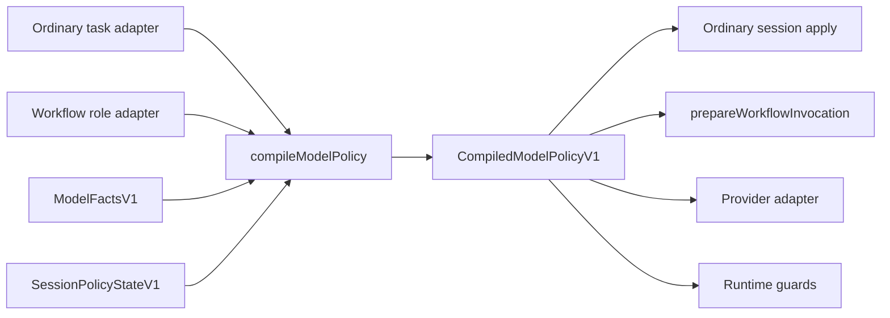

# Design: Capability-Compiled Per-Model Output Quality

- Date: 2026-07-28
- Status: Reviewed — PASS_WITH_NOTES (`agent://DesignGateRecheck`; `.design-gate.json`)
- Scope: L
- design_author: gpt
- Evidence SSOT: `docs/research/2026-07-28-per-model-output-quality-evidence.md`
- Base designs:
  - `docs/superpowers/specs/2026-07-25-per-model-optimization-design.md`
  - `docs/superpowers/specs/2026-07-25-per-model-optimization-p0-p2-design.md`
- Review: First gate `NEEDS_REVISION`; six blocking findings corrected; re-review `PASS_WITH_NOTES`, no blocking findings.

## 0. 执行摘要

**判断**：下一层优化必须从“按 family 继续堆 prompt”转为 **capability-compiled policy + 小型 per-model overlay + runtime gates + live ablation**。模型 ID 只选择版本化能力事实；任务角色策略决定本次工作需要什么；会话状态记录当前仍需完成什么。编译器将三者合成为 provider 可执行策略，但绝不把 OpenAI reasoning items、Claude thinking signatures、Gemini thought signatures、DeepSeek reasoning content 等 provider opaque state 统一转换成文本。该方向与证据 SSOT 的结论一致（`docs/research/2026-07-28-per-model-output-quality-evidence.md:7-17,107-116`）。

本设计是对已落地 P0-P2 的增量深化，不重写其可恢复工具输出、benchmark、handoff、结构化输出修复、scope metrics、lazy presentation、stable prefix 或调度能力。P0-P2 已定义 durable recovery、事实分层、结构化修复、scope、presentation、cache receipt 和安全并发合同（`docs/superpowers/specs/2026-07-25-per-model-optimization-p0-p2-design.md:27-155`）；workflow 当前也已有 role profile、prompt assembly、tool/schema/output policy、context eviction、retry、handoff、receipts 和 benchmark scaffolding（`docs/research/2026-07-28-per-model-output-quality-evidence.md:31-36`）。

落地分四阶段：

1. **先修已有接口失真**：让普通会话声明的输出与上下文字段真正被消费，并修复 Gemini session-start descriptor 决策在 model switch 后漂移；保留全部既有安全 loop guards。
2. **引入 capability compiler**：拆分 model facts、task/role policy、session state，并让 ordinary/workflow 经过同一纯编译 seam。
3. **接入 provider-native state、结构化输出分层和 runtime completion gates**：prompt 只负责意图，runtime 负责可证明完成。
4. **live paired ablation 与逐模型启用**：每次只改变一个 lever，以真实 provider 结果决定是否启用；不根据品牌或论坛印象调默认值。

## 1. 设计目标和范围

### 1.1 要解决的问题

普通会话与 workflow 已具备若干 per-model 优化，但控制面仍分裂：

- 普通会话内置 Claude、GPT-5/Codex、Grok、GLM、DeepSeek profiles，且开关默认关闭；当前 runtime 只实际应用 prompt block、tool scheduling/conflict，并暴露 context metadata（`docs/research/2026-07-28-per-model-output-quality-evidence.md:21-29`）。
- 普通会话 profile 声明 `outputTruncation`、`resultSummarization` 和 `SessionContextStrategy`，但 resolved policy 只返回 prompt、tool scheduling 与 hardened context strategy；输出策略没有普通路径 consumer，context strategy 只经 getter 暴露（`packages/coding-agent/src/model-optimization/types.ts:31-80`; `packages/coding-agent/src/model-optimization/runtime-policy.ts:15-64`; `packages/coding-agent/src/session/agent-session.ts:7306-7319`）。
- Gemini 的 descriptor inline 决策在 session start 计算并被闭包捕获，代码明确说明 mid-session model switch 继续沿用启动时决策（`packages/coding-agent/src/sdk.ts:2560-2570,3000-3033`）。
- 现有 family profile 把 prompt、thinking、tool、context 多个 lever 捆在一起；GLM 与 DeepSeek 还直接复用 Grok prompt template（`packages/coding-agent/src/model-optimization/default-profiles.ts:51-115`）。捆绑变体无法说明质量变化由哪个 lever 引起，这一缺口也已由证据 SSOT 明确记录（`docs/research/2026-07-28-per-model-output-quality-evidence.md:31-36`）。
- 论坛重复反馈集中于长会话漂移、过早结束、adapter/parser/template 协议不匹配，以及 fast/small model 的较窄安全自治范围；反例普遍存在，因此这些反馈只能发现 failure mode，不能形成模型排名（`docs/research/2026-07-28-per-model-output-quality-evidence.md:38-63,118-123`）。

### 1.2 成功标准

1. ordinary 与 workflow 都通过一个 capability compiler seam 生成 runtime policy；两条路径保留各自 orchestration，不复制能力判断。
2. model facts、task/role policy、session state 三类输入有独立版本、独立所有者和独立 receipt；model ID 不再隐式代表通用 OpenAI-compatible 行为。
3. provider opaque reasoning state 以 provider-native、未编辑的 typed payload 保存和回放；跨 provider 切换不把该状态降级成可见文本（`docs/research/2026-07-28-per-model-output-quality-evidence.md:69-105,107-110`）。
4. prompt、thinking/sampling、tool surface、structured output、context/cache、runtime guard 六类 lever 可独立启停和做 paired ablation。
5. 成功 terminal state 由 runtime gate 基于 unresolved work、required artifacts 和 verification evidence 决定，而不是由模型自称完成决定（`docs/research/2026-07-28-per-model-output-quality-evidence.md:44-49,111-116`）。
6. live gate 至少报告：final pass、first-pass、verification、scope、retry、duplicate tools、provider cache facts；不可观测值为 `null/unknown`，不补零。现有 benchmark 类型已经区分 provider fact、exact、estimate、unknown，并已包含 first-pass、scope、retry、duplicate read/grep 与 cache counters（`packages/coding-agent/src/workflow/benchmark/types.ts:8-16,64-109,111-181`）。
7. 不写任何未经 live paired run 验证的收益数字；fake runtime 只证明合同和测量链，不证明模型质量（`docs/research/2026-07-28-per-model-output-quality-evidence.md:115-123`）。

### 1.3 本次范围

- ordinary session 与 workflow 共用的 capability facts、compiler interface、compiled policy receipt。
- 覆盖 GPT/Codex、Claude、Gemini、Grok、GLM、DeepSeek、Qwen、Kimi、tiny/local 的初始模型矩阵。
- small per-model/family overlay；overlay 只表达无法由通用 task contract 或能力事实推导的提示差异。
- provider-native reasoning state carrier 与 provider adapter replay contract。
- tool surface、structured output、thinking/sampling、context/cache 编译。
- runtime completion/verification/scope/protocol guards。
- live paired A/B、逐 lever ablation、逐模型版本 gate 与回滚策略。
- 从现有 ordinary profiles 与 workflow profiles 到新控制面的增量迁移。

### 1.4 非目标

- 不重写或撤销已落地 P0-P2。
- 不新建第二套 agent loop、artifact store、benchmark runner、schema validator、tool scheduler 或 workflow runtime。
- 不把论坛反馈解释为模型排名或固有能力结论。
- 不实现在线学习、bandit 或自动修改生产路由。
- 不统一、摘要、解释或文本化 provider opaque reasoning state。
- 不请求模型输出可见 chain of thought。
- 不删除 Gemini runaway guard、cross-turn repeated-tool guard、tool conflict guard、scope guard、schema validator、budget gate 或其他既有安全门禁。当前 Gemini guard 会在连续 reasoning headers 无 tool call 时中断、丢弃 stalled reasoning-only turn、注入隐藏提醒并继续（`packages/coding-agent/src/session/agent-session.ts:6020-6108`）。
- 不在该设计中承诺 token、成本、时延或质量提升幅度。

## 2. 背景与约束

### 2.1 已落地基线

本设计把 P0-P2 当作 baseline，而不是重做清单：

| 已有能力 | 本设计如何复用 | 证据 |
|---|---|---|
| 可恢复工具输出与 receipt | compiled tool policy 只选择 transform；继续由既有 output manager 与 artifact adapter 执行 | `docs/superpowers/specs/2026-07-25-per-model-optimization-p0-p2-design.md:27-57` |
| 固定 benchmark 与 provenance | 扩展 variant/lever/facts fingerprint，不另建 runner | `docs/superpowers/specs/2026-07-25-per-model-optimization-p0-p2-design.md:59-75`; `packages/coding-agent/src/workflow/benchmark/types.ts:8-16,21-62` |
| role-aware handoff | session state 从 typed handoff 读取 unresolved/verification，不再次模型摘要 | `docs/superpowers/specs/2026-07-25-per-model-optimization-p0-p2-design.md:76-86` |
| structured repair/retry | compiler 选择 native tier；最终仍进入 canonical validator/retry seam | `docs/superpowers/specs/2026-07-25-per-model-optimization-p0-p2-design.md:88-99` |
| scope metrics | completion gate 读取已有 `ScopeMetricsV1`，不相信模型自报 | `docs/superpowers/specs/2026-07-25-per-model-optimization-p0-p2-design.md:101-111` |
| lazy tool/skill presentation | capability compiler 决定 direct/catalog 与 schema dialect，继续复用 `xd://` discovery | `docs/superpowers/specs/2026-07-25-per-model-optimization-p0-p2-design.md:113-121` |
| stable prefix/cache receipt | compiler 输出稳定段与动态段，但 cache 命中仍只认 provider facts | `docs/superpowers/specs/2026-07-25-per-model-optimization-p0-p2-design.md:123-129`; `packages/coding-agent/src/workflow/prompt-assembly.ts:92-172` |
| 安全并发 scheduler | compiler 只能收紧 capability cap；不能绕过 resource conflict 与 budget reservation | `docs/superpowers/specs/2026-07-25-per-model-optimization-p0-p2-design.md:131-142` |

### 2.2 证据约束

- official API/docs 决定已知 capability 与 provider 推荐用法；public forum 只提供 failure-mode 假设（`docs/research/2026-07-28-per-model-output-quality-evidence.md:3-5,38-40`）。
- capability metadata 必须带 provider、model/checkpoint、API/transport、adapter/parser、来源版本和探测版本；官方接口变化快，不能把本文枚举永久硬编码（`docs/research/2026-07-28-per-model-output-quality-evidence.md:118-123`）。
- 同一模型经不同 provider、proxy、chat template、stream parser 或 quantization 可能表现不同；raw upstream 与 parsed events 都必须可观测（`docs/research/2026-07-28-per-model-output-quality-evidence.md:44-63`）。
- native structured output 能力不能从品牌推断；必须按精确 model/transport 选择 `native JSON Schema > strict tool output > valid JSON + host validation > text parse/repair`（`docs/research/2026-07-28-per-model-output-quality-evidence.md:107-116`）。

### 2.3 设计原则

1. **Compiler 是 deep module**：调用者只提供三类输入并接收一个 compiled policy；provider 差异、fallback 和 capability precedence 留在 implementation 内。
2. **事实与政策分离**：model facts 描述“能做什么”；task/role policy 描述“本任务需要什么”；session state 描述“现在进行到哪里”。
3. **overlay 而非 fork**：共享 task contract 保持一致；overlay 只包含经 live ablation 证明必要的短差异（`docs/research/2026-07-28-per-model-output-quality-evidence.md:107-113`）。
4. **runtime 强于 prompt**：能由代码验证的 completion、scope、schema、protocol、budget、duplicate-call 约束不消耗 prompt 规则。
5. **unknown 是合法值**：未知 capability 使用保守路径并保留 provenance，不猜默认能力。
6. **一个 lever 一个变体**：先识别因果，再组合已通过的 lever。

## 3. 根因分析

### 3.1 是否需要根因分析

- **不需要。** 这是已知基线上的架构优化设计，不是未知故障诊断。
- 方案选择所需事实已经由 evidence SSOT、现有设计和关键代码给出：控制面分裂、普通会话字段未消费、Gemini model-switch drift、provider-native state 要求、existing P0-P2 seams 均已确认（`docs/research/2026-07-28-per-model-output-quality-evidence.md:19-36,107-123`）。

## 4. 方案对比

### 4.1 方案 A：继续堆 family prompts

- **核心思路**：扩展现有 `DEFAULT_MODEL_OPTIMIZATION_PROFILES`，为更多 family 增加完整 prompt template、thinking style、tool/context 默认值。
- **优点**：改动局部；沿用当前 profile resolver；短期容易观察 prompt 文本变化。
- **缺点**：
  - 继续把 prompt、thinking、tool、context 多 lever 捆绑，无法归因。
  - provider/transport capability 被压成 family 名称，无法表达同 family 不同 checkpoint/parser 差异。
  - 容易继续出现 GLM、DeepSeek 复用 Grok template 这类无证据继承（`packages/coding-agent/src/model-optimization/default-profiles.ts:77-115`）。
  - prompt 无法可靠解决 premature completion 与 parser mismatch；证据要求 runtime gate 与 adapter diagnosis（`docs/research/2026-07-28-per-model-output-quality-evidence.md:44-49`）。
- **适用前提**：仅适合一个已由 live ablation 证明有效、且不涉及 wire capability 的小 overlay 修正；不适合作为控制面。

### 4.2 方案 B：统一 capability compiler（推荐）

- **核心思路**：以 versioned `ModelFacts`、`TaskRolePolicy`、`SessionState` 为输入，纯编译得到 provider-specific `CompiledModelPolicy`；ordinary 与 workflow 在同一 seam 汇合，执行与 artifact 生命周期仍各自保留。
- **优点**：
  - 一份 model/transport facts 服务两个调用路径，提升 locality。
  - 每个 lever 可单独 fingerprint、A/B 和回滚。
  - 能自然表达 strict schema、thought signature、cache order、incompatible sampling param 等 provider 差异。
  - runtime guards 与 prompt overlay 解耦；小模型可以少背规则，多靠 code scaffold。
  - 能把 unknown capability 降级到保守 tier，而不是伪装成兼容。
- **缺点**：需要一次类型迁移；初期必须维护 facts provenance 与 conformance probes；compiler precedence 错误会影响两个调用路径。
- **适用前提**：先完成 Phase 1 的接口修缝与 receipts，使 shadow compile 有可信 baseline。

### 4.3 方案 C：在线自适应路由

- **核心思路**：根据 session telemetry、近期成功率、成本和延迟在线选择模型、effort、tools 或 context policy。
- **优点**：理论上能适应 provider 波动与任务差异；长期可利用积累的 live observations。
- **缺点**：
  - 当前 profiles 已捆绑多个变化，先上线自适应会把错误归因放大。
  - forum 证据不能支持模型排名，且公开报告混合 client/provider/parser/version/quantization（`docs/research/2026-07-28-per-model-output-quality-evidence.md:118-123`）。
  - 在线策略会改变生产默认路由，超出 P0-P2 “runner 只报告、不改默认配置”的安全合同（`docs/superpowers/specs/2026-07-25-per-model-optimization-p0-p2-design.md:72-75`）。
  - 探索流量、延迟目标与质量目标会形成额外控制回路，难以审计单个 lever。
- **适用前提**：只有 capability compiler、稳定 live benchmark、足量同版本 observations 和独立安全评审均成立后，才可作为后续独立设计；本设计不实现。

### 4.4 选型结论

选择 **方案 B：统一 capability compiler**。

它解决的是当前最深的接口问题：调用者不应学习每个 provider 的 reasoning replay、schema dialect、sampling 兼容性、cache order 与 tool parser 差异。删除 compiler 后，这些复杂性会重新散落到 ordinary reconcile、workflow invocation、provider adapter 和 prompts；因此该 module 具有真实 depth。方案 A 只增加 prompt 分支；方案 C 在因果测量与 facts 基础尚未稳定时引入反馈回路，均不适合作为下一步。

## 5. 详细方案

### 5.1 架构与收敛 seam

新增共享 module（最终路径由实现阶段按仓库命名收敛）：

```text
model-policy/
  facts.ts              # versioned provider/model/transport facts
  task-policy.ts        # ordinary task + workflow role intent
  session-state.ts      # unresolved state, evidence, opaque state refs
  compiler.ts           # pure compile interface
  receipt.ts            # input/output fingerprints + provenance
  overlays/             # short, independently gated prompt overlays
  adapters/             # ordinary/workflow input adapters
```

**ordinary/workflow 收敛 seam**：



- ordinary adapter 提供 `role=interactive_coding`、当前用户 contract、active tools、普通会话 pending obligations 和安全限制。
- workflow adapter 从现有 role profile、typed handoff、artifact inclusion、budget、output schema 与 verification commands 构造 task/role policy；现有 stable/dynamic prompt order保持不变（`packages/coding-agent/src/workflow/prompt-assembly.ts:92-172`）。
- compiler 不运行工具、不读文件、不改 session、不做 provider 请求；相同输入必须产出相同 policy 与 receipt。
- ordinary apply 继续通过 model-change reconcile 原子替换 active policy；现有实现已在 model change 后标 dirty，并在下一 dispatch 前 reconcile，失败时清空旧 policy（`packages/coding-agent/src/session/agent-session.ts:7295-7304,7322-7351,13103-13117`）。
- workflow `prepareWorkflowInvocation` 继续负责 role allowlist、presentation、schema/context/output wiring，但不再自行推断 provider capability；当前入口已集中调用 prompt strategy、schema enhancement、presentation policy，适合作为 adapter seam（`packages/coding-agent/src/workflow/runtime-invocation.ts:23-28,258-350`）。

### 5.2 三类输入必须分离

#### 5.2.1 `ModelFactsV1`

只记录可验证的 model/provider/transport 事实：

```ts
interface ModelFactsV1 {
  schemaVersion: 1;
  identity: {
    provider: string;
    model: string;
    checkpoint?: string;
    api: string;
    adapterVersion: string;
    parserVersion?: string;
  };
  reasoning: {
    mode: "none" | "native_opaque" | "native_visible" | "hybrid" | "unknown";
    replay: "provider_items" | "signed_blocks" | "reasoning_content" | "sdk_state" | "none" | "unknown";
    effortControl: "level" | "budget" | "model_variant" | "none" | "unknown";
    supportedEfforts: string[];
    incompatibleParams: string[];
  };
  tools: {
    transport: "native" | "template" | "text" | "unknown";
    strictArguments: boolean | null;
    parallelCalls: boolean | null;
    streamingShape: "delta" | "whole_call" | "none" | "unknown";
    schemaDialect: string | null;
    descriptorPlacement: "provider_schema" | "system_inline" | "either" | "unknown";
  };
  structuredOutput: {
    tier: "native_json_schema" | "strict_tool" | "valid_json" | "text" | "unknown";
    constraints: string[];
  };
  context: {
    windowTokens: number | null;
    nativeStatefulContinuation: boolean | null;
  };
  cache: {
    mode: "exact_prefix" | "explicit" | "conversation_affinity" | "none" | "unknown";
    ordering: string[];
    usageObservable: boolean | null;
  };
  provenance: {
    source: "catalog" | "official_doc" | "conformance_probe" | "user_override";
    sourceVersion: string;
    observedAt?: string;
  };
}
```

规则：

- model ID 只用于查找 facts，不直接触发行为。
- facts key 必须包括 API/adapter/parser；Qwen、Kimi、DeepSeek 的公开失败案例说明 transport/parser 是一等变量（`docs/research/2026-07-28-per-model-output-quality-evidence.md:48-63`）。
- `null/unknown` 不得被默认成 “OpenAI compatible”。
- live conformance probe 只能覆盖其精确 identity tuple；不能推广到整个 family。
- user override 可以收紧 capability，不能在无 conformance evidence 时宣称更强能力。

#### 5.2.2 `TaskRolePolicyV1`

只描述任务意图，不含 provider 事实：

```ts
interface TaskRolePolicyV1 {
  schemaVersion: 1;
  role: "interactive_coding" | WorkflowRole;
  taskClass: "research" | "plan" | "implement" | "review" | "repair" | "verify";
  risk: "low" | "medium" | "high";
  promptContract: {
    goal: string;
    constraints: string[];
    acceptance: string[];
    overlayId?: string;
  };
  reasoningIntent: "fast" | "balanced" | "deep";
  toolIntent: {
    semanticToolIds: string[];
    allowParallelReadonly: boolean;
  };
  outputContract: {
    kind: "natural_text" | "typed_artifact";
    schema?: unknown;
  };
  contextIntent: {
    requiredArtifacts: string[];
    preserveUnresolvedState: boolean;
  };
  completionRequirements: {
    requiredArtifacts: string[];
    verificationRequired: boolean;
    scopeRequired: boolean;
  };
}
```

同一个 role policy 可由不同 model facts 编译；同一个 model facts 也可服务 plan、implement、review 等不同 role。这样不会把“Claude/GPT 应该做什么”与“reviewer 必须产出什么”混为一体。

#### 5.2.3 `SessionPolicyStateV1`

只记录动态、可恢复的当前状态：

```ts
interface SessionPolicyStateV1 {
  schemaVersion: 1;
  activeModelFactsFingerprint: string;
  turnOrStageId: string;
  unresolvedItems: Array<{ id: string; kind: string; status: "open" | "blocked" }>;
  requiredArtifactStatus: Array<{ kind: string; present: boolean; artifactUri?: string }>;
  verificationEvidence: Array<{ commandOrCheck: string; status: "passed" | "failed" | "unknown"; artifactUri?: string }>;
  scopeStatus: "adhered" | "warning" | "violation" | "indeterminate";
  toolLedger: {
    calls: number;
    retries: number;
    duplicateReads: number | null;
    duplicateGreps: number | null;
  };
  providerState: ProviderOpaqueStateEnvelope[];
  contextCheckpoint?: {
    preservedStateArtifact: string;
    omittedArtifactUris: string[];
  };
}
```

session state 不是 prompt history 的同义词。长历史不能替代 active constraints 与 unresolved state，跨模型论坛模式支持在 turn/stage 边界显式重注入当前状态（`docs/research/2026-07-28-per-model-output-quality-evidence.md:44-47`）。workflow 应直接从现有 typed artifacts 与 deterministic handoff 构造这些字段，不额外调用模型摘要（`docs/superpowers/specs/2026-07-25-per-model-optimization-p0-p2-design.md:76-86`）。

### 5.3 provider opaque reasoning state 合同

```ts
interface ProviderOpaqueStateEnvelope {
  schemaVersion: 1;
  owner: {
    provider: string;
    model: string;
    api: string;
    conversationId?: string;
  };
  kind:
    | "openai_reasoning_item"
    | "anthropic_thinking_block"
    | "gemini_thought_signature"
    | "deepseek_reasoning_content"
    | "provider_native_other";
  payload: unknown;
  integrity: {
    byteHash: string;
    encoding: "provider_native_object" | "provider_native_bytes";
  };
  replay: "required_with_tool_result" | "required_full_turn" | "provider_managed";
}
```

必须满足：

1. `payload` 不进入 prompt template、summary、structured artifact 或 generic text history。
2. adapter 只能向 owner tuple 兼容的 provider/model/API replay 原 payload；replay 前后 byte/object canonical hash 必须一致。
3. OpenAI Responses reasoning items、Claude signed thinking blocks、Gemini thought signatures、DeepSeek `reasoning_content` 按各自官方方式保存和回放（`docs/research/2026-07-28-per-model-output-quality-evidence.md:69-105`）。
4. model switch 到不兼容 owner 时，旧 payload 留在 session state，但不发送、不文本降级；新模型只接收 task contract、resolved state、tool results 和允许的 visible history。切回兼容 owner 时才可恢复原 native chain。
5. provider 拒绝 stale/invalid state 时，adapter 记录 protocol failure，关闭该 native continuation，并以 preserved task/session state 开新 chain；不得把 opaque payload 解密、解释或转成“reasoning summary”。
6. compaction 只能移动 envelope 到 durable artifact 并保留引用，不能改 payload。证据 SSOT 明确要求 opaque state 保持 provider-native 且未编辑（`docs/research/2026-07-28-per-model-output-quality-evidence.md:107-114`）。

### 5.4 Compiler interface

```ts
interface CompileModelPolicyInput {
  modelFacts: ModelFactsV1;
  taskPolicy: TaskRolePolicyV1;
  sessionState: SessionPolicyStateV1;
  semanticTools: SemanticToolContract[];
  featureGates: ModelPolicyFeatureGates;
}

interface CompiledModelPolicyV1 {
  schemaVersion: 1;
  prompt: {
    sharedContract: string;
    overlay: string | null;
    stableSections: string[];
    dynamicState: string;
  };
  reasoningAndSampling: {
    wireParameters: Record<string, unknown>;
    replayMode: ModelFactsV1["reasoning"]["replay"];
    omittedIncompatibleParameters: string[];
  };
  tools: {
    descriptors: CompiledToolDescriptor[];
    presentationMode: "direct" | "catalog";
    descriptorPlacement: ModelFactsV1["tools"]["descriptorPlacement"];
    strictArguments: boolean;
    parallelCalls: boolean;
    streamingShape: ModelFactsV1["tools"]["streamingShape"];
    schemaDialect: string | null;
    maxConcurrentTools: number;
  };
  output: {
    tier: "native_json_schema" | "strict_tool" | "valid_json" | "text_repair";
    wireSchema?: unknown;
    hostValidationRequired: boolean;
  };
  contextAndCache: {
    stablePrefixOrder: string[];
    checkpointPolicy: string;
    continuationMode: "provider_native" | "replay_messages" | "new_chain";
    replayOpaqueStateOwners: string[];
    cacheMode: ModelFactsV1["cache"]["mode"];
    cacheOrdering: string[];
    cacheUsageObservable: boolean;
  };
  guards: RuntimeGuardPlanV1;
  receipt: CompiledModelPolicyReceiptV1;
}

function compileModelPolicy(input: CompileModelPolicyInput): CompiledModelPolicyV1;
```

编译 precedence：

1. 安全 hard guards；不可被 overlay 或用户 override 关闭。
2. 精确 conformance facts。
3. 官方/catalog facts。
4. task/role requirements。
5. independently-gated overlay。
6. conservative unknown fallback。

冲突示例：task 请求 `deep` reasoning，但 model facts 标记 effort 不可控，则 compiler 不伪造 `reasoning_effort`；保留 reasoning intent 于 receipt，省略 wire 参数。task 请求 typed artifact，但 facts 只有 valid JSON，则选择 valid JSON + canonical host validator，而不是发送不支持的 native schema。

字段消费是 compiler 合同，不允许保留“声明但未执行”的 facts：

| `ModelFactsV1` 输入 | `CompiledModelPolicyV1` / runtime 行为 |
|---|---|
| `reasoning.mode/replay/effortControl/supportedEfforts/incompatibleParams` | 选择 opaque-state adapter、`replayMode`、wire effort 与 `omittedIncompatibleParameters`；unknown 不发送 reasoning 参数 |
| `tools.transport/schemaDialect/descriptorPlacement` | 选择 native/template/text adapter、编译 descriptor schema、决定 system/provider placement |
| `tools.strictArguments` | `strictArguments=true` 才声明 provider strict；`false/null` 强制 host validation |
| `tools.parallelCalls` | 与 task intent、resource-conflict scheduler 取交集；`false/null` 串行 |
| `tools.streamingShape` | 选择 whole-call/delta parser；unknown 使用 adapter baseline 并记录 conformance unknown |
| `structuredOutput.tier/constraints` | 选择四级 output tier；constraints 编译进 wire schema validator |
| `context.nativeStatefulContinuation` | 选择 provider-native continuation、message replay 或 new chain |
| `cache.mode/ordering/usageObservable` | 生成 cache key/order 与 receipt observable 标志；unknown 不声称命中 |

任何新增 facts 字段必须在同一变更中增加 compiled consumer 或被 schema 拒绝；不接受 reserved/inert 字段。

### 5.5 Prompt 编译

prompt 分为三层：

1. **Shared task contract**：目标、约束、acceptance、工具语义与完成条件；ordinary/workflow 共用语义结构。
2. **Small overlay**：只保留该精确 family/model cohort 经 live ablation 证明有效的措辞、section order 或 descriptor placement 差异。
3. **Dynamic state capsule**：当前 unresolved items、failed verification、required artifacts、scope status；从 session state 确定性生成。

规则：

- reasoning model 不注入通用 step-by-step 或可见 chain-of-thought 指令；官方 Gemini 指南明确不应要求 thinking models 输出可见思维链，GPT 也应使用明确 exploration/stop criteria 而非矛盾指令（`docs/research/2026-07-28-per-model-output-quality-evidence.md:69-75,85-90`）。
- tool behavior 能在 schema、adapter 或 runtime gate 表达时，不重复写入 prompt。
- overlay 必须有独立 id、version、facts cohort 和 live ablation receipt；未通过时为空。
- stable prefix 继续使用已落地顺序；provider 特有 cache ordering 由 adapter 映射，不能只因本地 hash 相同宣称 cache hit（`packages/coding-agent/src/workflow/prompt-assembly.ts:92-172`; `docs/research/2026-07-28-per-model-output-quality-evidence.md:75-82,97-105`）。

### 5.6 Tool-surface compiler

所有工具先定义一次 semantic contract：稳定 tool id、语义、参数约束、权限等级、资源读写集合、错误合同。compiler 再按 facts 生成 wire representation：

- native strict tools：生成 provider 支持的严格 schema。
- native non-strict tools：生成兼容 schema，并始终 host validate。
- template tools：使用 checkpoint 官方 chat template 与 parser，不用品牌默认模板。
- text-only：仅用于已批准的 narrow task；输出经过 parser、allowlist、argument validator 与 scope gate。
- descriptor placement 根据 facts 选择 provider schema、system inline 或 catalog；Gemini auto 决策必须随 model switch 重算。
- provider 限制与 role allowlist 取交集；catalog discovery 不能提升权限。P0-P2 已规定 restricted child 的 catalog 必须先经过 role allowlist（`docs/superpowers/specs/2026-07-25-per-model-optimization-p0-p2-design.md:113-121`）。
- parallel tool calls 只有 facts 明确支持、task 允许只读并发、scheduler 无资源冲突时启用；unknown 一律走安全串行。
- raw provider payload、parsed tool event、schema validation result 和 execution result 建立同一 correlation id。论坛证据显示 adapter/parser/template mismatch 常被误归因给模型（`docs/research/2026-07-28-per-model-output-quality-evidence.md:44-63`）。

### 5.7 Structured-output compiler

按以下 tier 编译，不按 family 硬编码：

1. `native_json_schema`：provider/model/transport 精确支持；仍执行 host canonical validation。
2. `strict_tool`：把最终 artifact 作为 strict tool 参数；执行 host validation。
3. `valid_json`：provider 仅保证 JSON；执行 bounded extraction、host validation、预算内 retry。
4. `text_repair`：最后兼容层；保留 raw output artifact，确定性修复只处理 fence/BOM/外围文本，不补造语义字段。

现有 P1 已定义 canonical 修复、retry budget 与 attempt receipts，该 seam 继续作为最终验证器（`docs/superpowers/specs/2026-07-25-per-model-optimization-p0-p2-design.md:88-99`）。DeepSeek JSON mode 只保证 valid JSON，可能返回空 content，因此不能编译成 native schema tier（`docs/research/2026-07-28-per-model-output-quality-evidence.md:99-105`）。

### 5.8 Context 与 cache 编译

- stable sections 与 dynamic sections 保持现有固定顺序；provider adapter 再按 provider cache contract 编码（`packages/coding-agent/src/workflow/prompt-assembly.ts:92-172`）。
- checkpoint 只在 safe turn/stage boundary 发生，必须保留 unresolved state、verification evidence、tool-call/result pairs、opaque state envelopes 与 recovery URIs（`docs/research/2026-07-28-per-model-output-quality-evidence.md:107-116`）。
- ordinary session 的 context strategy 只影响发送给 provider 的 view，不删除 persisted transcript；当前类型与 hardening 已规定 preserve user turns 且不 evict persisted rows（`packages/coding-agent/src/model-optimization/types.ts:45-60`; `packages/coding-agent/src/model-optimization/runtime-policy.ts:31-49`）。
- cache receipt 同时记录 local stable/dynamic hashes 与 provider cache usage。只有 provider 暴露的 read/write counters 才是 cache facts；当前 assembly 已在不可观测时返回 null（`packages/coding-agent/src/workflow/prompt-assembly.ts:109-133,175-193`）。
- effort/thinking 参数变化可能改变 cache key；Claude 官方 cache 顺序为 tools → system → messages，且 thinking/effort 变化可能使 cache 失效（`docs/research/2026-07-28-per-model-output-quality-evidence.md:77-83`）。

### 5.9 Runtime guards

`RuntimeGuardPlanV1` 分两层：

#### 永久在线安全 guards

- provider protocol/schema validation；
- unknown/malformed tool name 拒绝与历史修复；
- tool permission、scope、resource conflict、budget；
- repeated identical tool-call detection；
- Gemini reasoning-header runaway interrupt；
- opaque state owner/integrity/replay validation；
- artifact recovery URI 可读性。

这些 guards 不受 model overlay 或 ablation 关闭。现有 Gemini guard 的启用条件和中断恢复行为见 `packages/coding-agent/src/session/agent-session.ts:6020-6108`；P0-P2 已规定 tool conflict 与 budget reservation 语义（`docs/superpowers/specs/2026-07-25-per-model-optimization-p0-p2-design.md:131-142`）。

#### Task completion guards

成功 terminal transition 前必须检查：

```text
unresolvedItems.open == 0
requiredArtifacts.present == true
verificationRequired => every required verification passed
scopeRequired => scopeStatus != violation
schema/output validator passed
no unpaired tool call/result
```

- **Workflow**：上述条件均来自 typed artifacts、handoff、verifier 与 `ScopeMetricsV1`。缺任一条件时不得进入 success；转入继续、repair、blocked 或 error，并受现有 attempt/time/cost budget 限制。
- **Ordinary session 不创建一套隐式 workflow state**。Hard completion 仅对已有显式 obligation 生效：非空 TodoStore、active Goal、required-yield subagent contract、或调用者/extension 注册的 `OrdinaryTaskObligation`。无显式 obligation 的普通问答保留当前 terminal 语义，只运行 protocol/error guards。
- `OrdinaryTaskObligation` 保存在 `AgentSession`，仅包含来源、open/blocked 状态、required verification id 与 artifact reference；不得靠模型文本或通用 NLP 猜测任务类型。Todo/Goal 更新同步更新 obligation；verification tool receipt 只能关闭匹配 id。
- 集成点是 `AgentSession.#handleAgentEvent` 的 settled `agent_end` maintenance：在现有 empty-stop、provider retry、compaction/error 分支处理完成后、外部 terminal `agent_end` 发出前评估。继续执行复用现有 `#checkTodoCompletion`、`#emitSessionStopEvent` 与 continuation caps；达到 `todo.remindersMax`、`SESSION_STOP_CONTINUATION_CAP`、goal/tool/time/cost budget 时停止自动继续并发出明确 `incomplete/blocked` diagnostic，不循环伪装 success（`packages/coding-agent/src/session/agent-session.ts:4910-5173,6429-6476,12849-12972`）。
- prompt 中“继续直到完成”不是 gate evidence。跨模型 premature completion 反馈支持 runtime state transition，而非 prompt-only promise（`docs/research/2026-07-28-per-model-output-quality-evidence.md:44-49`）。

## 6. 模型矩阵

矩阵是**初始编译政策**，不是排名。每行只定义已知事实、unknown fallback 与要验证的 overlay；精确 model/transport facts 可覆盖 family 行。

| Model cohort | Prompt | Thinking / sampling | Tool surface | Structured output | Context / cache | Runtime guard |
|---|---|---|---|---|---|---|
| GPT / Codex | 共享 task contract + 明确 exploration/early-stop criteria；不加通用可见推理指令。GPT 官方指南要求定义探索与停止条件，并指出矛盾指令会降低表现（`docs/research/2026-07-28-per-model-output-quality-evidence.md:69-75`）。 | 按 facts 映射 `reasoning_effort`；不假设所有 GPT/Codex 相同。Responses reasoning items 通过 native continuation/replay 保存（同上 `:69-75`）。不发送 facts 标记不兼容的 sampling 参数。 | 优先 strict function schema；工具语义保持一份，adapter 生成 Responses/function wire shape（同上 `:72-74`）。 | 精确支持时 native JSON Schema；否则 strict tool，再否则 host validation。 | exact common prefix；静态 instructions/examples/tools 在前。cache hit 只认 provider usage（同上 `:75`）。 | exploration bound、pending-work、verification、unpaired-tool、schema gate；不因模型建议 commit/完成而绕过失败验证。相关 failure mode 见 `docs/research/2026-07-28-per-model-output-quality-evidence.md:53-56`。 |
| Claude | concise shared contract；overlay 主要优化 tool descriptions，不复制角色规则。Anthropic 将 tool descriptions 视为主要性能 lever（`docs/research/2026-07-28-per-model-output-quality-evidence.md:77-83`）。 | 保留 thinking blocks/signatures；effort 只按精确 facts 发送。不请求 visible chain of thought。 | provider schema 中写清 what/when/limitations/examples；相关操作可合并成高 signal tool，但不改变 semantic permission（同上 `:79-83`）。 | Claude 4.5+ 精确 facts 可用 native JSON Schema/strict tools；其他版本按 tier 降级（同上 `:80-82`）。 | adapter 遵循 tools → system → messages cache order；effort 变化记录 cache invalidation（同上 `:82`）。 | pending-work、verification、context handoff、signed-state integrity；保留现有 agent-loop 安全行为。长会话与 premature stop 模式见 `docs/research/2026-07-28-per-model-output-quality-evidence.md:44-47,53-57`。 |
| Gemini | 清晰指令；dynamic state capsule 显式标记 latest active state；few-shot 只有独立 A/B 通过才启用。不请求可见思维链（`docs/research/2026-07-28-per-model-output-quality-evidence.md:85-90`）。 | `thinking_level`/legacy budget 按精确 model facts 互斥编译；Gemini 3.x 默认 sampling，尤其 temperature 1.0，默认不改（同上 `:85-90`）。 | descriptor inline/schema placement 随 active model 重算；保留 native function protocol 与 thought signatures。当前实现的 session-start 固定决策见 `packages/coding-agent/src/sdk.ts:2560-2564`。 | 精确支持时 native schema；始终 host validation（`docs/research/2026-07-28-per-model-output-quality-evidence.md:89-90`）。 | 保留 thought signatures；支持时使用 implicit prefix caching（同上 `:89-90`）。 | **保留** header-runaway/tool-call guards；增加 model-switch descriptor refresh、invalid MCP name normalization、output bound。既有 guard 见 `packages/coding-agent/src/session/agent-session.ts:6020-6108`。 |
| Grok | bounded task/scope contract；不默认注入 step-by-step。detailed implementation-plan overlay 只有 live ablation 通过后启用。论坛只支持 narrow-task 假设，不是排名（`docs/research/2026-07-28-per-model-output-quality-evidence.md:53-63`）。 | Grok 4.5 默认 high reasoning 且不能关闭；generic sampling/stop 参数可能不兼容，multi-agent effort 语义可为 agent 数量；全部按 facts 编译（`docs/research/2026-07-28-per-model-output-quality-evidence.md:92-97`）。 | tool arguments 隐式 strict；stream function call 以 whole chunk 到达，adapter 不强制 delta parser（同上 `:94-96`）。 | 精确支持时 native JSON Schema（同上 `:96`）。 | stable conversation/cache IDs 与 exact starting messages；安全 checkpoint compaction（同上 `:97`）。 | scope allowlist、verification、whole-call parser conformance、partial-work completion gate。 |
| GLM | 不再继承 Grok overlay；默认只使用 shared contract。现有 GLM 直接使用 `explicit-grok` 与 step-by-step（`packages/coding-agent/src/model-optimization/default-profiles.ts:90-101`），迁移后须由 GLM 自身 ablation 决定 overlay。 | official facts 未在 evidence SSOT 建立时为 unknown；不发送推测 effort/sampling 参数。 | 按精确 provider/API/parser conformance 选择 native/template；unknown 使用 host validation 与安全串行。 | 未确认 native tier时从 strict-tool/valid-JSON/text 中按 probe 结果选择，不由 family 名称推断。 | window/cache facts 来自 catalog/provider usage；无事实时为 null。 | malformed/empty tool name、history poisoning、scope、verification、retry budget guards；不移除通用 loop guards。 |
| DeepSeek | shared contract；thinking/non-thinking mode 由 facts 决定，不复用 Grok prompt。当前复用事实见 `packages/coding-agent/src/model-optimization/default-profiles.ts:103-115`。 | thinking tool turns 完整 replay `reasoning_content`；effort 与 ignored sampling controls 按 DeepSeek 精确事实发送（`docs/research/2026-07-28-per-model-output-quality-evidence.md:99-105`）。 | tool/parser 与 parallel-call capability 必须按 runtime conformance；论坛只支持“runtime 有差异”，不支持固有排名（`docs/research/2026-07-28-per-model-output-quality-evidence.md:53-63`）。 | JSON mode = valid JSON，不等于 schema；host validator/retry 必开，并处理 empty content（同上 `:103-105`）。 | prefix cache；命中/未命中使用 provider exposed usage（同上 `:105`）。 | empty-output、reasoning/tool channel pairing、parallel-call conformance、schema retry、verification、scope。 |
| Qwen | checkpoint-specific shared contract；需要示例时只用与官方 chat template 一致的短样例。 | hybrid thinking switches 与 sampling 按 checkpoint；thinking mode 不使用官方明确警告的 greedy decoding（`docs/research/2026-07-28-per-model-output-quality-evidence.md:99-103`）。 | 优先官方 Hermes-style tools；不使用 stopword-based ReAct parser（同上 `:101-103`）。 | evidence 未确认 schema tier时按 conformance probe 选择，并始终 host validate。 | checkpoint、quantization、KV cache、stream parser 都进入 facts identity；不能只按 `qwen-*` 选择（`docs/research/2026-07-28-per-model-output-quality-evidence.md:53-63`）。 | raw/parsed event correlation、missing/malformed native tag、stream parser、scope、verification；narrow executor 默认较小 tool allowlist。 |
| Kimi | shared contract；没有 live evidence 时 overlay 为空。公开反馈同时存在 malformed proxy tools 与长上下文成功反例，不能形成排名（`docs/research/2026-07-28-per-model-output-quality-evidence.md:53-63`）。 | 只发送精确 provider/model 暴露的 controls；其余 unknown。 | 优先经过 conformance 的 native/Anthropic-compatible transport；若 tool call 变成文本则判 protocol failure，不通过 prompt 猜修复（同上 `:60`）。 | 按精确 transport probe 选择；unknown 使用 host validator。 | context/cache 由 provider facts 与 usage 给出；长上下文个例不变成 hard threshold（同上 `:60,118-123`）。 | tool-as-text/malformed-call、parser、scope、verification、retry budget；快速/小 checkpoint 收紧 autonomy。 |
| tiny / local | 一次一个窄任务；少量正向约束与 2–4 个同形 input→output examples；格式尽量由 prefill/stop/schema/post-process scaffold。fast/small model 的安全自治范围更窄（`docs/research/2026-07-28-per-model-output-quality-evidence.md:44-49`）。 | 不请求 chain of thought。sampling 只能来自精确 checkpoint/runtime facts；不把某个 tiny 模型参数推广到所有 local 模型。 | 默认最小 allowlist、串行工具、短 schema；template/parser/quantization/checkpoint 都进入 identity。 | 优先 strict scaffold/prefill + host validation；无法稳定产出时只路由到 natural-text 或单 artifact narrow task。 | 小 window 采用确定性 state capsule、短 tool result 和早 checkpoint；cache facts 来自具体 server，不从“local”推断。 | 强制 scope、call cap、duplicate tools、verification；多阶段任务由 runtime 拆成单任务，不把完整 workflow 规则塞入 prompt。 |

### 6.1 Unknown fallback（所有 cohort 的硬下界）

矩阵中的 `unknown` 不允许临场猜测。每个 cohort 均使用同一确定性下界：

| Cohort | capability tuple 不完整时 |
|---|---|
| GPT/Codex、Claude、Gemini、Grok | 已知精确 transport 能力继续使用；未知 reasoning/sampling 参数全部省略；未知 parallel/strict/structured 能力降为串行 + host validation + `text_repair` |
| GLM、DeepSeek、Qwen、Kimi | 无 tool transport/parser conformance 时，ordinary 回到当前 feature-off adapter baseline，workflow 若合同需要工具则 fail closed；部分 facts 已知时仅启用已确认 transport，串行 + host validation + `text_repair` |
| tiny/local | 无 checkpoint/template/parser facts 时不授予自治工具；仅允许 natural-text 或单一、allowlisted、host-validated artifact task |

所有 cohort 的 cache unknown 都表示“不发送推测 cache 参数、不声称命中、usage=`unknown`”；context window unknown 使用 catalog/provider 的既有安全上限，不能由论坛个例推断。该表覆盖每一模型行，精确 facts 只能提升已验证能力，不能绕过 hard guards。

### 6.2 Overlay 管理规则


- overlay key 至少包含 `family/cohort + taskClass + role + overlayVersion`；不能只用品牌。
- overlay 最多改变 prompt section/wording/examples，不得改变 tool permission、schema validator、scope、budget 或 opaque state replay。
- overlay 加入默认矩阵前必须有 same-model live paired ablation；反例或无显著证据时保持 shared contract。
- GLM、DeepSeek 在迁移时首先去除 Grok 文案继承；不是改成另一套猜测文案，而是回到 overlay 为空的共享基线。
- Gemini descriptor placement 属于 compiled tool policy，不属于 prompt overlay；model switch 必须重新编译。

## 7. 错误处理与回退

### 7.1 Facts 缺失或冲突

- 精确 conformance facts 与低精度 family/catalog facts 冲突时，精确 tuple 生效，并在 receipt 记录 overridden source。
- facts 过期、缺失或 identity 不匹配时：省略未知 wire params、工具安全串行、host validation 开启、structured output 使用不高于已确认 tier、cache metrics 为 unknown。
- compiler 不允许“兼容 OpenAI”成为默认 capability bundle。

### 7.2 编译失败

- 编译必须原子完成；失败不得保留上一模型 policy。现有 ordinary reconcile 已采用“失败即清空旧 optimization”语义（`packages/coding-agent/src/session/agent-session.ts:7322-7351`）。
- ordinary 在 feature gate 期间回到当前 opt-out baseline，并保留 hard guards；错误进入 diagnostic receipt。
- workflow 若 required output/tool capability 无安全 tier，必须在 provider call 前失败为明确 configuration/capability error；不能静默降低 required artifact 合同。

### 7.3 Provider state replay 失败

- integrity/owner 不匹配：拒绝 replay，保留原 artifact，记录 protocol violation。
- provider 表示 continuation stale：关闭 native chain，以 visible task/session state 开新 chain；opaque payload 不文本化。
- tool-call/result pair 缺失：runtime repair 或显式失败；不得让 prompt 猜测缺失结果。

### 7.4 Live regression

- 任一 hard invariant 回归：立即关闭该 lever/model cohort gate，回到此前已通过 policy。
- soft metric 无法观测：结论为 unknown，不据此推广。
- provider/model/adapter/parser 版本变化：原 gate 不自动继承；需要新的 facts fingerprint 和 paired run。

## 8. 四阶段落地

### Phase 1：修复普通会话接口失真与 Gemini model-switch drift

**顺序不可交换；这是后续 shadow compile 的可信基线。**

1. 普通会话复用已有 live tool seam，而非另建包装链：给 `ToolSession` 增加 ordinary-only `modelToolOptimization.processResult/receipts`，将 `workflow/tool-optimization.ts:applySessionToolOutput()` 泛化为“workflow 优先，否则 ordinary active policy”。`bash`、`read`、`grep` 已统一调用该函数（`packages/coding-agent/src/workflow/tool-optimization.ts:14-23` 及对应工具 imports），因此 `outputTruncation`/`resultSummarization` 可复用 P0 `processToolOutputDetailed`、artifact recovery 与 receipts。Workflow stage 继续独占 workflow policy；feature-off 返回原文。
2. 将 `SessionContextStrategy` 接到 `sdk.ts` 已有 `transformContext` outbound seam（`packages/coding-agent/src/sdk.ts:2862-2865`）：每次请求读取 mutable `modelOptimizationRuntime.resolved.contextStrategy`，只构造 provider-view messages，再执行 extension/steering transform；不得调用 `agent.replaceMessages` 或改 persisted transcript。`preserveUserTurns=true`、`evictPersisted=false` 继续硬化；append-only context 对 view divergence 按既有 replay 语义处理。
3. Gemini descriptor 修复同时覆盖 system prompt 与 provider tool schema：把 `inlineToolDescriptors` 从 SDK session-start 常量改为 mutable active-model decision，由 reconcile/`#applyModelOptimization` 更新；`rebuildSystemPrompt` 调用时读取当前值。Agent loop 的 `pruneToolDescriptions` 也改为 per-request getter，而不是构造期 boolean，保证 `normalizeTools` 与 system inventory 使用同一 decision。显式 user `on/off` 固定，只有 `auto` 随 model switch 重算（当前 drift：`packages/coding-agent/src/config/inline-tool-descriptors-mode.ts:14-25`; `packages/coding-agent/src/sdk.ts:2484-2489,2949-2951`）。
4. 为普通会话输出/context/descriptor decision 生成 versioned receipt；覆盖 active model、profile、applied fields、input/output bytes、recovery URI、descriptor placement。
5. 保留并回归现有 Gemini header-runaway、cross-turn tool loop、tool conflict 与 provider guards；本阶段不以新 compiler 替换它们（`packages/coding-agent/src/session/agent-session.ts:5999-6108`）。

**阶段 gate**：声明字段均有 consumer 或明确 compile-time rejection；Gemini↔non-Gemini 双向切换后 descriptor placement 与 active model 一致；feature-off ordinary output 与原 baseline 一致；所有 hard guards 仍启用。

### Phase 2：Capability compiler 与 ordinary/workflow seam

1. 落地 `ModelFactsV1`、`TaskRolePolicyV1`、`SessionPolicyStateV1`、`CompiledModelPolicyV1`、receipt。
2. 从现有 profiles 迁移事实与政策：model patterns 只选择 facts cohort；prompt strategy 迁到 overlay；workflow role requirements 迁到 task policy。
3. ordinary reconciler 调用 compiler，再原子 apply compiled policy。
4. workflow `prepareWorkflowInvocation` 通过 adapter 调用同一 compiler；保留现有 prompt assembly、presentation、schema validator、tool output manager 与 scheduler。
5. 先运行 shadow compile：记录新旧 policy diff，不改变 provider request；diff 包括 prompt section hash、wire params、tool schema hash、output tier、context/cache policy、guards。
6. GLM/DeepSeek 取消 Grok overlay 继承，回到 shared contract；在各自 live ablation 通过前不添加替代 overlay。

**阶段 gate**：相同三输入 deterministic；ordinary/workflow 对同 model facts 的 capability decisions 相同；role/tool permission 仍由 workflow policy 收紧；shadow diff 中无未知 wire param 或安全 guard 丢失。

### Phase 3：Provider-native state、structured tiers 与 runtime completion

1. provider adapters 接入 `ProviderOpaqueStateEnvelope`，建立 capture/replay/integrity receipts。
2. structured output 由 compiler 选 tier，所有 tier 汇合到现有 canonical validator/retry seam。
3. context checkpoint 保存 unresolved state、verification、tool pairs、opaque envelopes 与 recovery URIs。
4. shared runtime guard 执行 protocol、opaque state、duplicate tool 与 scope；workflow 对 typed artifacts 执行 hard completion gate。Ordinary 只对 Todo/Goal/required-yield/extension 显式注册的 `OrdinaryTaskObligation` 执行有界 continuation，其他普通任务不伪造 unresolved state。
5. provider switch 测试覆盖同 provider/model continuation、同 family 不同 API、跨 provider、不兼容 stale state、切回原 owner。
6. hard guards 与 overlay ablation 分离；任何 prompt/tool lever 变体都不能关闭 guards。

**阶段 gate**：opaque payload hash 在 capture/replay 后一致；跨 provider 无文本降级；required verification 缺失时不能成功终止；schema/empty-output/protocol failure 有 bounded retry 与完整 receipt。

### Phase 4：Live paired ablation 与逐 cohort rollout

1. 以已落地 P0-P2 + Phase 1 修缝作为 baseline，不与旧 greenfield 或裸 provider 比。
2. 按精确 `provider/model/checkpoint/API/adapter/parser/factsFingerprint` 建 variant。
3. 每次只改变一个 lever：prompt overlay、thinking/sampling、tool surface、structured tier、context/cache、runtime completion nudge。hard guards 不作为可关闭变量。
4. 同一 case、base commit、request、tools、credentials class、verification、repetition policy 下运行 baseline/variant；运行顺序交错，保存每次原始 receipt。
5. 首批 cohort 顺序按风险而非排名：
   - 先 GPT/Codex、Claude、Gemini：官方 capability 文档较完整，且能覆盖三类 opaque state/descriptor/cache 差异（`docs/research/2026-07-28-per-model-output-quality-evidence.md:69-90`）。
   - 再 Grok、DeepSeek：覆盖 incompatible sampling、whole-call streaming、valid-JSON tier 与 reasoning replay（同上 `:92-105`）。
   - 再 Qwen、Kimi、GLM、tiny/local：先建立 transport/checkpoint conformance facts，再测 overlay（同上 `:53-63,118-123`）。
6. 只有 paired live gate 通过的 lever 才进入该 cohort default；组合 policy 还需一次组合 paired run，避免独立通过的 lever 交互回归。

**阶段 gate**：live evidence 与 exact facts fingerprint 绑定；fake runtime 不产生 quality pass 结论；无 provider cache facts时 cache 结论为 unknown；不自动修改模型路由。

## 9. 质量门禁与验证计划

### 9.1 Live paired A/B 合同

每个 run 必须固定并记录：

- suite/case/suite version、base commit、request、allowed/forbidden paths、verification commands；现有 benchmark case 已具备这些字段（`packages/coding-agent/src/workflow/benchmark/types.ts:21-50`）。
- provider、model、checkpoint、API、adapter/parser version、facts fingerprint。
- task/role policy fingerprint、session state seed、compiled policy receipt。
- 仅一个 active lever diff；组合验证除外。
- baseline 与 variant 各自按 suite repetition policy 重复；现有 P0-P2 设计要求 fixed case paired repetition，runner 不修改生产配置（`docs/superpowers/specs/2026-07-25-per-model-optimization-p0-p2-design.md:59-75`）。

### 9.2 必报质量指标

| Gate | 判定 | 数据来源 |
|---|---|---|
| Live final pass | required verification、artifact、scope、terminal status 均满足才 pass | live runtime + verifier + artifact store |
| First-pass | 初次模型 attempt 未经过 schema retry、repair/fallback 即满足合同 | `firstPassed/firstPassRate`，已有类型 `packages/coding-agent/src/workflow/benchmark/types.ts:111-145` |
| Verification | 每条 required command/check 的实际结果；模型自述不计 | verifier artifact；live runner 已将 terminal、verification 与 scope 合并判 pass（`packages/coding-agent/src/workflow/benchmark/live-runtime.ts:222-245`） |
| Scope | forbidden write 为 hard fail；unplanned change 保留 reviewer 判定 | `ScopeMetricsV1` / git diff；合同见 `docs/superpowers/specs/2026-07-25-per-model-optimization-p0-p2-design.md:101-111` |
| Retry | schema、provider、protocol、repair retries 分类型计数；减少 retry 不能以 final pass 回归换取 | benchmark stage metrics 已有 schemaRetries/fallbacks（`packages/coding-agent/src/workflow/benchmark/types.ts:64-82`） |
| Duplicate tools | duplicate read、duplicate grep、重复相同 tool+args；同时看是否因漏读导致质量下降 | benchmark 已有 duplicateReadCount/duplicateGrepCount（同上 `:64-79`） |
| Cache facts | provider cache read/write tokens、observable flag；local prefix hash 单独报告 | `TokenBucketMetrics` 与 prompt receipt（`packages/coding-agent/src/workflow/benchmark/types.ts:84-109`; `packages/coding-agent/src/workflow/prompt-assembly.ts:109-133`） |

### 9.3 Gate 规则

- **Hard fail**：verification fail、scope violation、required artifact 缺失、opaque state corruption、unpaired tool call/result、permission bypass、hard guard 被关闭。
- **Quality non-regression**：使用现有 configurable `BenchmarkQualityGate` 对 final pass 与 quality score 判定，不在设计里宣称固定收益（`packages/coding-agent/src/workflow/benchmark/types.ts:175-187`）。
- **First-pass**：作为独立指标；final pass 相同但 first-pass 恶化时，不直接推广，先定位 retry/protocol/structured tier。
- **Retry/duplicate tools**：只能作为质量保持后的效率判据，不能替代 verification 与 scope。
- **Cache**：只有 `cacheObservable=true` 且 provider counters 非 null 才能下 cache 结论；stable hash 相同只证明本地 prefix 一致。
- **Unknown**：任何缺失 provider facts、TTFT、queue、cost、cache attribution 均保持 null/unknown；现有 P0-P2 已规定不可观测字段不得补零（`docs/superpowers/specs/2026-07-25-per-model-optimization-p0-p2-design.md:59-75`）。
- **Fake runtime**：只验证 compiler determinism、schema、receipts、state transition 和 report plumbing；`liveQualityUnknown=true`（`packages/coding-agent/src/workflow/benchmark/types.ts:164-173,214-223`）。

### 9.4 验证层次

1. **Compiler contract fixtures**：每个矩阵 cohort 至少覆盖 known、unknown、conflict、stale facts；断言 wire params、tool dialect、output tier、cache order、guards 与 receipt。
2. **Opaque state adapter fixtures**：capture/replay hash、owner mismatch、provider switch、stale continuation、compaction recovery。
3. **Ordinary integration**：profile on/off、输出 transform recovery、context provider view、Gemini↔non-Gemini switch、显式 descriptor override、系统 prompt/tool schema refresh。
4. **Workflow integration**：各 role policy、stable/dynamic order、allowlist、structured tiers、handoff、completion/repair transition。
5. **Safety regression**：Gemini runaway、repeated tool loop、malformed call、resource conflict、budget、scope、schema exhaustion。
6. **Live paired smoke**：每个启用 cohort 至少运行其协议特有场景与固定 suite；保存 provider raw/parsed events 的受控诊断 artifact。
7. **Combined policy run**：单 lever 通过后，组合后的最终 policy 再与 baseline paired；防止 cache、effort、tool surface、prompt 互相影响。

## 10. 迁移与兼容

### 10.1 配置迁移

现有 `ModelOptimizationProfile` 分解为：

| 现有字段 | 新归属 |
|---|---|
| `modelPattern` | facts cohort selector；只负责匹配 identity |
| `promptStrategy` | shared task policy + independently-gated overlay |
| `toolStrategy.outputTruncation/resultSummarization` | compiled tool-result policy，执行仍复用 P0 manager |
| `maxConcurrentTools/resourceConflictMode` | task intent 与 capability/safety 上限交集 |
| `contextStrategy` | compiled context provider-view policy |
| workflow role/output/presentation fields | `TaskRolePolicyV1` + compiled output/tool surface |

迁移步骤：

1. Phase 1 先让现有 ordinary 字段语义真实，避免迁移 inert 配置。
2. 提供只读 adapter 将旧 profile 解析为新三输入；shadow receipt 标记 `source=legacy_profile_adapter`。
3. shadow compile 与现有 request 对比；不一致必须分类为 intended、unknown-facts 或 defect。
4. cohort live gate 通过后，production consumer 切到 compiled policy；旧 profile loader 只负责配置迁移，不再参与 runtime decision。
5. 所有 built-in/user config callers 迁完后删除重复 runtime fields 与旧 prompt inheritance；不保留两套可同时生效的 policy。

### 10.2 Feature gates

feature gate 必须按 lever 与 cohort 分离：

```text
compiler.shadow
compiler.active
opaqueState.nativeReplay
promptOverlay.<overlayId>
toolSurface.<cohort>
structuredOutput.<cohort>
contextCache.<cohort>
runtimeCompletionGate
```

安全 hard guards 不提供关闭型 ablation gate。紧急回滚关闭的是新 lever，回到已通过 baseline，而不是关闭 schema/scope/protocol/loop safety。

### 10.3 数据迁移

- receipts、facts 与 compiled policy 都版本化；旧 benchmark report 保持可读。
- session snapshot 新增 opaque envelopes 时，旧 snapshot 无该字段按空数组读取；不得从旧 visible thinking 猜造 native state。
- cache/facts observations 与 exact identity tuple 绑定；model/adapter/parser 升级后旧 observation 仅作历史记录。

## 11. 风险与缓解

| 风险 | 影响 | 缓解 |
|---|---|---|
| Compiler 成为巨型条件分支 | locality 下降，难测 | capability axes 驱动编译；family overlay 只处理 prompt；provider wire mapping留在 adapter |
| 错误 facts 同时影响 ordinary/workflow | 扩大回归面 | version/provenance、shadow diff、exact conformance tuple、cohort gate、原子回滚 |
| Opaque state 泄露或被文本化 | 隐私、协议错误、质量漂移 | typed envelope、owner/integrity checks、禁止进入 prompt/artifact summary、durable access control |
| Prompt overlay 再度膨胀 | 指令冲突、不可归因 | overlay size/section receipt、一个 lever 一个 A/B、无 live evidence则为空 |
| Runtime completion gate 导致无尽循环 | 成本与卡死 | bounded attempts/budget、显式 blocked/error terminal、保留 loop guards；completion gate 不等于无限重试 |
| Conservative unknown 降级质量 | 部分模型能力未利用 | 报告 unknown capability；补精确 conformance facts后再提升 tier，不以猜测换取表面能力 |
| Cache 优化反而破坏质量 | stale state 或 effort 固化 | dynamic state 不进 stable policy；provider counters与quality同时 gate；effort变更生成新 fingerprint |
| Tiny/local prompt 承载过多规则 | 遗漏约束、格式漂移 | 单任务、短 contract、examples/prefill、runtime scope/schema/verification scaffold |
| Forum反馈误导配置 | 错误降级某品牌 | forum只生成 ablation hypothesis；默认变更只认 exact live paired evidence（`docs/research/2026-07-28-per-model-output-quality-evidence.md:38-63,118-123`） |
| 新设计覆盖 P0-P2 | 重复实现与回归 | compiler 只决定 policy；执行继续复用 artifact、validator、scheduler、benchmark、handoff seams |

## 12. 可观测性与审计

`CompiledModelPolicyReceiptV1` 至少记录：

```ts
interface CompiledModelPolicyReceiptV1 {
  schemaVersion: 1;
  compilerVersion: string;
  modelFactsFingerprint: string;
  taskPolicyFingerprint: string;
  sessionStateFingerprint: string;
  overlayId: string | null;
  leverGates: Record<string, boolean>;
  promptStableHash: string;
  promptDynamicHash: string;
  toolSurfaceHash: string;
  outputTier: string;
  reasoningParameters: string[];
  omittedIncompatibleParameters: string[];
  opaqueState: Array<{ kind: string; ownerHash: string; payloadHash: string; replayed: boolean }>;
  guards: string[];
  factsProvenance: Array<{ path: string; source: string; version: string }>;
}
```

审计要求：

- receipt 不包含 opaque payload 原文，只包含 owner/payload hash。
- raw provider payload 只进入受控诊断 artifact；常规 logs 记录 correlation id 与 parser result。
- benchmark report 关联 compiled receipt、tool optimization receipts、prompt assembly receipt、scope artifact、verification artifact。
- provider facts、exact bytes、estimates、unknown 保持分栏；不得把估算 token 与 provider usage 合并（`packages/coding-agent/src/workflow/benchmark/types.ts:8-16,84-109`）。

## 13. 关键决策摘要

1. Scope=L；根因分析不需要。
2. 推荐 capability compiler，不继续扩张 family prompt forks，也不在本阶段做在线自适应路由。
3. P0-P2 是已落地 baseline；本设计只新增编译控制面、opaque state 与 runtime quality gates。
4. model facts、task/role policy、session state 必须分离。
5. ordinary/workflow 在 `compileModelPolicy` seam 收敛，orchestration 与执行 adapter 不合并。
6. provider opaque reasoning state 保持 native、未编辑、owner-bound；跨 provider 不文本降级。
7. prompt overlay 必须小、独立、按 exact cohort live ablation。
8. structured output 按 capability tier 编译，最终统一 host validation。
9. 第一阶段先消费普通会话已声明字段并修复 Gemini model-switch descriptor drift。
10. 所有现有安全 loop guards 保留；新 feature gates 不能关闭 hard guards。
11. 成功状态由 pending work、artifacts、verification、scope 与 protocol evidence决定。
12. live paired A/B 必报 first-pass、verification、scope、retry、duplicate tools 与 provider cache facts；不承诺未测收益。

## 14. Handoff

### 14.1 实现输入

实现前必须由非设计作者完成独立 design review，重点检查：

- compiler interface 是否真正隐藏 provider 差异，而非把所有 capability 字段泄露给调用者；
- opaque state 在 ordinary、workflow、compaction、model switch、retry 路径是否都无文本降级；
- Phase 1 是否先于 compiler rollout；
- ordinary/workflow 是否复用既有 P0-P2 seams；
- runtime completion gate 是否有 bounded blocked/error 出口且不削弱安全 loop guards；
- 模型矩阵中的事实是否都可回溯到 evidence SSOT 或代码行；
- live gate 是否能隔离单一 lever，并将 unknown 与 provider facts 分开。

建议文档落点：

`docs/superpowers/specs/2026-07-28-capability-compiled-per-model-output-quality-design.md`

### 14.2 同会话继续

```text
请对 docs/superpowers/specs/2026-07-28-capability-compiled-per-model-output-quality-design.md 执行独立 Design Review Gate。设计作者为 GPT；评审者必须使用不同模型。重点核对 evidence SSOT 引用、P0-P2 增量边界、ordinary/workflow 收敛 seam、opaque reasoning state 不文本化、Phase 1 顺序、安全 loop guards、模型矩阵与 live paired quality gates。评审结论必须为 PASS、PASS_WITH_NOTES、NEEDS_REVISION、NEEDS_REDESIGN 之一；只有 PASS 或 PASS_WITH_NOTES 且 design gate 有效后才能进入实现。
```

### 14.3 新会话恢复 prompt

```text
请阅读 docs/research/2026-07-28-per-model-output-quality-evidence.md、docs/superpowers/specs/2026-07-25-per-model-optimization-design.md、docs/superpowers/specs/2026-07-25-per-model-optimization-p0-p2-design.md，以及 docs/superpowers/specs/2026-07-28-capability-compiled-per-model-output-quality-design.md。随后执行独立 Design Review Gate。设计作者为 GPT；评审者必须使用不同模型。重点核对 evidence SSOT 引用、P0-P2 增量边界、ordinary/workflow 收敛 seam、opaque reasoning state 不文本化、Phase 1 顺序、安全 loop guards、模型矩阵与 live paired quality gates。评审结论必须为 PASS、PASS_WITH_NOTES、NEEDS_REVISION、NEEDS_REDESIGN 之一；只有 PASS 或 PASS_WITH_NOTES 且 design gate 有效后才能进入实现。
```