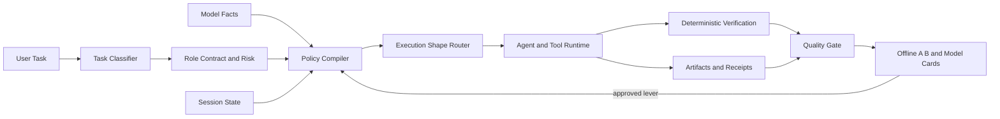

# Design: Quality-Gated Multi-Model Execution and Context Optimization

- Date: 2026-07-30
- Status: Confirmed
- Scope: L

## 1. 设计目标和范围

### 1.1 要解决的问题

当前 `workflow` 分支已经实现多模型工作流、普通会话与工作流的模型档案、能力策略编译、工具输出压缩、阶段交接、结构化输出修复、惰性 MCP、可用性预检和 benchmark 骨架，但仍存在四类系统性问题：

1. 默认路由和 prompt/tool 特例仍部分绑定静态模型名，模型版本、provider 协议和真实能力变化后容易漂移。
2. Prompt、tool schema、skills、history、tool results、subagent outputs 与 artifact 的 token 成本尚未形成统一质量闭环。
3. 多模型阶段数固定，简单任务也可能承担 plan/review/coordination 成本；同模型多角色没有先与单会话分阶段基线比较。
4. 当前离线 benchmark 能验证报告与优化管线，不能单独证明真实模型质量提升；旧设计文档中的部分 gap 已被后续提交关闭。

### 1.2 成功标准

生产默认采用“质量优先”目标函数。以下是硬门禁：

- 任务最终正确率不低于当前生产 baseline。
- Scope adherence、确定性验证可信度、权限边界和关键信息可恢复性不退化。
- 关键阶段无合格模型时 fail closed，不静默降级到未达质量档位的模型。
- 所有有损 tool/context 变换都持久化原始 artifact，并提供一跳恢复 URI、hash 和省略范围。
- 同一变更使用固定任务、固定环境、paired A/B 和重复运行；不得用单次演示调整默认策略。

只有硬门禁通过后才优化：

- 单位成功成本（包括首次执行、重试、fallback、review、返工和重复工具调用）。
- p50/p95 完成延迟。
- system/tool-schema/skills/history/tool-results/artifacts/output/cache 各 token 桶。
- 重复 read/grep、schema repair、无效工具调用、用户纠正和人工接管率。

### 1.3 本次范围

- 将 per-model 优化从静态档案集合演进为“模型事实 + 阶段合同 + 会话状态”的策略控制面。
- 设计 per-model prompt、工具说明、工具表面、输出结构、上下文与缓存策略。
- 设计 single-session、independent-review、parallel-exploration 三种执行形态及选择规则。
- 设计 artifact-backed 上下文、role-aware handoff、惰性呈现和可恢复压缩。
- 设计真实模型评测、trace 诊断、灰度、回滚和策略生命周期。
- 明确当前分支已完成能力、剩余缺口和实施顺序。

### 1.4 非目标

- 不在本设计阶段修改实现代码；工作树状态只作为运行时探测输入，不固化为设计前提。
- 不按公开排行榜直接调整生产默认模型。
- 不承诺 RTK、Cursor、Anthropic 或论文中的收益可直接迁移到 omp。
- 不默认引入完整 CWL、在线自学习路由、tree-sitter/PageRank repo-map 或外部 CLI runtime。
- 不通过容忍质量下降换成本收益。
- 不保存或暴露模型隐藏推理链。

## 2. 背景与约束

### 2.1 当前分支事实

分析基于 `workflow` 分支 HEAD `81290eb1bd`。相对 `origin/main`，已提交分支改动约为 246 个文件、+43,462/-192 行。2026-07-30 评审时重新探测工作树：`git diff --name-only --diff-filter=U | wc -l` 为 `0`，不存在 unresolved paths；同时存在大量 staged A/M/D 用户改动。后者不等于冲突，也不阻塞基线验证。因此本设计只把已提交代码和可定位源码视为实现事实；Phase 0 必须在执行时重新探测 unresolved paths，不复用本段历史快照作阻断条件。

已确认的生产能力：

| 能力 | 状态 | 代码证据 |
|---|---|---|
| 确定性 workflow 状态机 | 已实现 | `packages/coding-agent/src/workflow/engine.ts`, `transitions.ts` |
| 多模型角色路由与 fallback | 已实现 | `model-router.ts`, `default-config.ts` |
| 普通会话 family profile | 已实现 | `model-optimization/default-profiles.ts` |
| ModelFacts 能力策略编译 | 已实现，默认 shadow 为主 | `model-policy/compiler.ts`, `adapters.ts` |
| Prompt stable-prefix 组装 | 已实现 | `workflow/prompt-assembly.ts`, `prompt-strategy.ts` |
| 可恢复 tool output 优化 | 已实现 | `tool-output-manager.ts`, `optimization-receipt.ts` |
| 普通会话 provider-only elision | 已实现 | `model-optimization/provider-context-adapter.ts` |
| Role-aware stage handoff | 已实现 | `workflow/stage-handoff.ts` |
| 结构化输出分层修复 | 已实现 | `workflow/structured-output-repair.ts` |
| 工具并发/资源冲突控制 | 已实现基础策略 | `workflow/tool-scheduling.ts`, agent loop 接线 |
| Tool/skill catalog presentation | 已实现、默认关闭 | `workflow/presentation-policy.ts` |
| 模型 availability preflight | 已实现 | `availability-*.ts` |
| Live/fake workflow benchmark | 已实现骨架 | `workflow/benchmark/`, `workflow-bench` command |
| 惰性 MCP 连接 | 已实现 | `mcp/manager.ts` |
| Kimi K3 能力适配 | 已实现 schema/catalog 层修正 | commit `c918385058`, `model-policy/adapters.ts` |

仍需优先解决的设计/产品缺口：

- 静态 workflow profiles 与能力 compiler 的权威关系尚未完成迁移，compiler active levers 需要逐项 A/B。
- `ModelProfile` 仍保留 deprecated alias 和较多具体模型排序，长期维护面大。
- 默认 workflow 固定阶段较重，缺少按任务复杂度和风险裁剪阶段的公开合同。
- 现有 12-case fake suite 是管线 smoke；live fixtures 的覆盖、重复运行和统计置信度不足。
- 工具 prompt 尚未形成“每个工具独立 held-out eval + 历史 scar-tissue 审计”的持续优化机制。
- 需要检测重复 attachment/reminder/delta 注入和跨阶段相同 artifact 的重复传输。

### 2.2 仓库约束

- Prompt 必须位于静态 `.md`/Handlebars 文件，不在代码中拼接。
- Catalog 值从 `@oh-my-pi/pi-catalog/*` 导入；不手改 generated `models.json`。
- 不引入 `any`、`ReturnType<>`、inline imports 或 `console.*` 污染 TUI。
- 代码改动后使用 `bun check`，不使用 `tsc`。
- 工具输出必须可恢复、可截断、TUI-safe；路径、tabs、长行遵循现有工具渲染约束。
- 外部模型事实只作为候选证据；生产能力以 catalog/provider 实测和本地 benchmark 为准。

### 2.3 外部证据与适用边界

| 来源 | 日期/类型 | 可采信结论 | 边界 |
|---|---|---|---|
| Anthropic, Effective context engineering for AI agents | 2025-09-29，官方工程文 | 最小高信号 context、JIT retrieval、compaction、structured notes、subagent 隔离 | Claude 经验，不等于 omp 指标 |
| Anthropic, Writing effective tools for agents | 2025-09-11，官方工程文 | 少而清晰的工具、token-efficient response、分页/过滤/截断、真实 eval 驱动工具说明 | 案例主要来自 Anthropic 内部工具 |
| Anthropic, Multi-agent research system | 2025-06-13，官方工程文 | 多 agent 适合 breadth-first 独立探索；约 15x chat token；coding 并行性通常弱；artifact 直写可减 telephone game | 90.2% 为内部 research eval，不可迁移到 coding |
| OpenAI, A practical guide to building agents | 官方指南 | 先用强模型建 baseline，再在 eval 门禁下替换小模型；优先增量式 orchestration | 通用指南，无 omp 实测 |
| Aider repo-map | 官方文档 | symbols + graph ranking + 动态约 1k token map 可减少无目标读取 | 不证明当前 regex map 是瓶颈 |
| PLAY2PROMPT, ACL Findings 2025, DOI 10.18653/v1/2025.findings-acl.1347 | 同行评审论文 | 用真实 tool play 自动改进说明和示例可提升跨模型工具使用 | benchmark 与 omp 工具不同，需重建 eval |
| Lost in the Middle, TACL 2024, DOI 10.1162/tacl_a_00638 | 同行评审论文 | 长上下文中信息位置显著影响利用率 | 不能推导固定 utilization 阈值 |
| Rethinking the Value of Multi-Agent Workflow | arXiv 2601.12307v1 | 同模型多角色应先与共享 KV-cache 的单代理分阶段 baseline 比较 | 预印本；异构工作流仍是开放问题 |
| Claude Code #17591, #32099, #36336, #46968, #50998 | 2026 GitHub 用户/工程反馈 | raw subagent transcript、compaction 丢结果、薄摘要、并发 edit retry、重复 attachment 会造成显著浪费和质量损失 | 个案与版本相关，作为失败模式而非发生率 |
| 仓内 RTK/Aider/Cursor/CWL 研究 | 2026-07-25 文档 | 工具输出卫生、分桶、可恢复摘要和质量门禁是高优先级 | 外部百分比均不可作为 omp 承诺 |

访问日期：2026-07-30。搜索摘要只用于发现来源；上表关键来源均已读取原文或 GitHub API issue 正文。

## 3. 根因分析（按需）

### 3.1 是否需要根因分析

- 不需要故障式根因分析。
- 理由：这是现有系统的架构深化与产品优化，方向选择依赖当前实现盘点、外部证据和目标函数，而非单一未知故障成因。

### 3.2 已确认事实

不适用。当前实现事实与外部证据已分别记录在第 2 节。

### 3.3 未确认假设

- 能力 compiler 替代静态 profile 决策后，能降低维护成本且不降低质量。
- 按复杂度裁剪 workflow 阶段能降低单位成功成本，同时保持高风险任务质量。
- catalog tool/skill presentation 对 large tool surface 能节省净 token，且展开成本不会抵消收益。
- 当前 regex repo-map 与简化 eviction 是否构成真实质量瓶颈仍未知。

### 3.4 对设计的影响

所有未确认假设必须先进入 shadow receipts 和 paired live A/B。没有 held-out 质量证据的 lever 不进入默认生产路径。

## 4. 方案对比

### 4.1 方案 A：继续强化静态 per-model profiles

- 核心思路：为 Claude、GPT、Grok、GLM、DeepSeek、Kimi 等继续维护独立 prompt/tool/context 常量。
- 优点：实现简单，沿用当前配置结构。
- 缺点：模型名和版本快速漂移；相同能力规则重复；容易把社区印象固化成默认策略。
- 适用前提：模型集合小、版本稳定、每项特例都有长期回归集。当前不满足。

### 4.2 方案 B：全量动态路由与在线 prompt/workflow 搜索

- 核心思路：在线根据 trace、成本与 judge 分数自动搜索 prompt、模型和 workflow DAG。
- 优点：理论上能适应模型更新和任务分布变化。
- 缺点：搜索空间为模型 × prompt × tools × context × workflow；judge 偏差和在线探索可能直接污染生产质量。
- 适用前提：大规模可信 eval、稳定 judge、流量隔离与成熟回滚。当前不满足。

### 4.3 方案 C：能力编译 + 阶段合同 + 证据驱动控制面

- 核心思路：以 `ModelFacts + RoleContract + SessionState` 编译执行策略；静态 profile 只保留兼容和显式覆盖；所有 lever 按 shadow → paired A/B → canary 激活。
- 优点：复用当前 compiler、receipts、workflow、benchmark 和 artifact 基础；风险可分解；不会让在线实验直接控制生产。
- 缺点：需要建立更完整的 live eval 和迁移期双轨可观测性。
- 适用前提：现有能力编译与 benchmark seam 可继续扩展。当前已满足。

### 4.4 选型结论

选择方案 C。方案 A 仅作为迁移兼容层；方案 B 仅在离线数据、judge agreement 和 canary 基础成熟后考虑。

## 5. 详细方案

### 5.1 核心架构



三类输入：

1. `ModelFactsV1`：provider、API、tool transport、descriptor placement、reasoning、structured-output tier、context/cache 能力及 provenance。
2. `RoleContractV1`：task class、risk tier、required tools、write policy、output contract、quality floor、independence requirement、budget ceiling。
3. `SessionPolicyStateV1`：未完成 obligations、open findings、context pressure、artifact refs、retry/fallback 历史和 remaining budget。

输出 `CompiledModelPolicyV1`：

- prompt overlay 与 stable/dynamic section order；
- reasoning mode/effort/replay；
- tool allowlist、descriptor placement、aliases、concurrency、conflict mode；
- context retention、artifact inclusion、cache policy；
- structured output tier、repair policy；
- completion guard、fallback 与 degradation semantics。

### 5.2 Per-model prompt 设计

#### 5.2.1 共享核心与短 overlay

- `shared-contract.hbs.md` 保存所有模型一致的权限、完成定义、证据和验证合同。
- 每个模型 overlay 只描述经过 eval 证明的行为差异，不复制完整系统 prompt。
- Overlay 按 failure feature 命名和选择，例如 `needs_explicit_completion`, `schema_drift_prone`, `tool_hesitation`, `parallel_tool_capable`，不直接以营销型号作为逻辑条件。
- 模型 family/id 只用于解析 `ModelFacts` 与显式用户覆盖。

#### 5.2.2 默认提示策略

- Claude-like natural instruction followers：自然语言分区、最少机械步骤、少量 canonical examples。
- GPT reasoning/tool models：显式 `Goal / Constraints / Contract / Done` 分区；不要求公开 CoT。
- Grok-like models：明确 scope、停止条件、证据与输出结构；避免无界 verbosity。
- GLM/DeepSeek/Kimi 与兼容 provider：能力事实优先；未知能力不继承其他 vendor overlay。
- Tiny/local models：读取专门 small-model prompt 规则，减少复杂标签、嵌套 schema 和隐式合同。

以上是初始 policy hypotheses，不是永久排名。建立版本化 failure taxonomy，首批至少区分 `scope_drift`、`tool_selection_error`、`incomplete_verification` 与 `permission_violation`；只有同一 failure class 累积至少 5 个相互独立、真实且可复现的 case，并在独立 held-out set 上证明净收益后，才创建或保留对应 overlay。单个 anecdote、合成样本或同一根失败的重复记录不计入 5-case 门槛。

Canonical overlay 示例：

```handlebars
{{! overlays/needs_explicit_completion.hbs.md }}
## Completion overlay
- Before stopping, reconcile every required deliverable against the shared `Done` contract.
- If any deliverable or required verification is incomplete, continue or report the exact blocker; never present partial work as complete.
- In the final response, cite the verification evidence required by the shared contract.
```

组装顺序固定为 `shared-contract.hbs.md` 后接零个或多个短 overlay；overlay 只追加行为差异，不覆盖共享权限、scope、证据或完成合同。Compiler 根据经 held-out eval 确认的 failure features 选择 overlay：例如某个 model facts version 在 completion-obligation 集群上稳定漏项，才映射到 `needs_explicit_completion`。选择结果必须记录 `failure_feature`、overlay version、支持它的 case IDs 与 policy fingerprint；未知模型或无支持证据时不选择该 overlay。上例中的 `shared Done contract` 是对共享合同的引用，不复制其正文。

#### 5.2.3 Few-shot 生命周期

- Few-shot 只来自真实失败样本或 tool-play 生成后经验证的 canonical case。
- 每个样例记录 `case_ids`, `failure_class`, `models_tested`, `prompt_version`, `expiry_condition`。
- 单次只改一个主要变量；若组合实验，fingerprint 标记 `combo:*`。
- Held-out 质量无显著提升或 token/latency 净负收益时删除样例。

#### 5.2.4 Cache-friendly assembly

稳定前缀固定为：

1. system static
2. role policy
3. essential tool presentation
4. skill catalog

动态后缀固定为：

1. assignment
2. repo-map
3. stage handoff
4. selected history

不得在稳定前缀中注入时间戳、workflow id、动态模型可用性、重复 reminders 或当前任务文本。Provider 未报告 cache counters 时保持 `unknown`，不得以 prefix hash 相同推断 cache hit。

Cache 诊断记录 provider 报告的 read/write tokens、request count 与适用的 provider/model/API version；未报告时只记 `unknown`。Prefix fingerprint 只用于比较组装稳定性，不等价于 cache hit，也不进入 cache 收益结论。

### 5.3 工具、schema 与输出优化

#### 5.3.1 工具表面

- 先按 role contract 取权限 allowlist，再按模型能力决定 descriptor placement；compiler 不得扩大权限。
- 核心工具完整呈现；非关键工具进入 catalog，一跳读取 schema。
- Catalog 模式默认保持 feature gate 关闭，直到 tool selection 和任务成功 held-out eval 通过。
- 同义、重叠工具优先合并或明确 namespacing；工具名 alias 必须由模型级工具 eval 证明。

#### 5.3.2 工具提示优化流程

每个工具建立独立版本化 eval：

- 正确工具选择；
- 参数结构与边界；
- 错误恢复；
- 多工具顺序；
- 权限拒绝；
- 最终任务状态。

使用 schema inferability probe 发现冗余说明，但删除前必须检查 `git blame`/commit/issue，保留因真实失败加入的 scar tissue。Prompt 只教何时调用、输入语法、agent-owned failure 和 canonical examples；实现机制、缓存、内部函数留在代码。

#### 5.3.3 工具结果合同

- 所有可能产生大输出的工具支持 selector、range、pagination、filter 或 `concise|detailed`。
- 默认输出为完成下一步决策所需的最小高信号内容。
- `read` 保留正文；不允许用路径/字节统计替换正文。
- Bash/test 失败保留 exit code、failed test names、首个根因块、尾部错误和 reproduction command。
- 截断/摘要必须保存原始内容，返回 recovery URI、sha256、original/visible bytes 和 transforms。
- 对重复 tool output 以 artifact hash 引用，不在未来 turn 重复注入全文。

去重只作用于字节等价的 content hash 或同一 immutable artifact hash。Receipt 必须记录被替换位置、原始/保留 hash、artifact ref 与估算节省桶；语义相似但 hash 不同的内容不得由确定性去重器合并。

#### 5.3.4 结构化输出

- Layer 1：确定性去 BOM/zero-width、unwrap fence、提取完整 JSON。
- Layer 2：严格 schema 验证，不发明字段、不猜 enum、不宽松 coercion。
- Layer 3：仅在 budget 允许时模型修复，prompt 只含 violation、schema 摘要和有界 previous output。
- Layer 4：耗尽后 fail closed 或按 role contract 降级文本，不把 invalid artifact 标为成功。

### 5.4 上下文与 token 成本控制

#### 5.4.1 Token ledger

每次 provider request 记录：

- `system_static`
- `role_policy`
- `tool_schema`
- `skill_catalog`
- `assignment`
- `repo_map`
- `handoff`
- `history`
- `tool_results`
- `artifacts`
- `output`
- `cache_read`, `cache_write`, `uncached_input`

计量规则固定如下：provider 对整个 request/response 返回的 usage 与 cache counters 只能记到 provider 可证明的总量，标 `provider_fact`；provider 未返回某项 cache counter 时该项保持 `unknown`，不得从 prefix hash 或总 input tokens 推断 cache hit。各输入桶按实际送入 provider 的 UTF-8 字节数计算 `bytes = Buffer.byteLength(serializedBucket, "utf8")`，估算 `tokens = Math.ceil(bytes / 4)` 并标 `estimate:utf8_bytes_div_4_v1`；该值是统一的近似量，不宣称是上界，也不替代 provider tokenizer。若 provider 只给 input 总量，可同时保留总量 `provider_fact` 与分桶 estimates，但不得强行缩放分桶以凑总量。`output` 仅在缺少 provider output usage 且保留了完整输出时使用相同估算；内容缺失或经过不可逆变换且原文不可恢复时标 `unknown`。实现应抽取共享纯函数，复用现有 `Buffer.byteLength(..., "utf8")` 语义；不得把 `tool-output-manager.ts` 的局部 helper 当作跨模块公共 API。

#### 5.4.2 Artifact-backed working set

- 原始计划、patch、验证日志、review、subagent output 与大 tool result 都持久化为不可变 artifact。
- Model context 只放 typed digest、artifact ref、hash、关键行和恢复方式。
- Subagent 直接写 artifact；主 agent 不转述或重写全文，避免薄摘要与 telephone game。
- Compaction 不得删除 artifact；只更换 provider-visible working set。

#### 5.4.3 Role-aware retention

- Planner → Implementer：目标、约束、non-goals、决策、affected files、acceptance、risks、rollback。
- Implementer → Reviewer：plan ref、actual changed files、patch ref、tests/commands、unresolved items。
- Reviewer → Repair：所有 open blocking findings、failed verification、attempted repair history。
- 任何 handoff 构建失败都退化为 keep-all refs，不静默丢内容。

#### 5.4.4 优化顺序

1. 去重重复 reminders、attachments、skill/tool deltas。
2. 清理旧 tool result 正文，保留 artifact ref。
3. 阶段边界 handoff。
4. 惰性 skill/tool schema 呈现。
5. 缓存稳定前缀。
6. Repo-map 和 targeted retrieval。
7. 最后才使用模型摘要。

模型摘要先最大化 recall，再优化 precision。关键信息召回率和一跳恢复成功率是硬门禁。

### 5.5 多模型执行形态与 workflow

#### 5.5.1 三种执行形态

`single_session`：

- 同一模型在共享会话中分阶段执行。
- 适合单文件/局部修复、上下文强耦合、可由确定性验证覆盖的任务。
- 作为同模型多角色 workflow 的强 baseline，利用 KV/prompt cache 连续性。

`independent_review`：

- 实现与 review 使用不同 vendor 或独立上下文。
- 适合高风险、多文件、权限/安全、迁移、公共 API 和难以由测试完全覆盖的任务。
- Reviewer 只消费 plan/patch/verification/handoff artifacts，不继承实现轨迹噪音。

`parallel_exploration`：

- 只用于互相独立的证据域、搜索方向或文件 ownership 清晰的模块。
- 每个 worker 有 mission、non-goals、范围、预算、artifact output schema 和 stop conditions。
- 不允许多个 writer 未冻结契约时同时修改共享核心文件。

#### 5.5.2 Complexity gate

Triage 根据以下信号选择形态：

- 写入风险和不可逆性；
- affected package/file 数量；
- 接口、状态、权限、数据与跨模块依赖；
- 是否需要独立认知去相关；
- 可否用确定性 verifier 完整覆盖；
- 搜索空间是否可独立分解；
- context pressure 和预算。

推荐默认流程：

```text
triage
  -> plan (complex/high-risk only)
  -> implement
  -> deterministic verify
  -> independent review (risk-gated)
  -> bounded repair
  -> final verify
```

当前完整 workflow 保留为 high-risk preset。简单任务不强制 plan reviewer；同模型 planner/reviewer 默认合并成单会话阶段，除非 A/B 证明独立实例有净收益。

Phase 4 初始决策矩阵：单文件局部修改且确定性 verifier 可完整覆盖时使用 `single_session`，省略独立 plan/review；多文件或接口变更但 verifier 可完整覆盖时使用带 plan 阶段的 `single_session`；权限、安全、数据迁移或公共 API 变更使用不同 vendor 的 `independent_review`，不可用时按 §5.8 阻断或显式 degraded；只有搜索方向或文件 ownership 可独立分解时使用 `parallel_exploration`。文件数只是诊断信号，不得覆盖权限、不可逆性或 verifier 完整性。该矩阵先 shadow，阈值只可由 held-out task distribution 修订。

#### 5.5.3 并发与失败控制

- 并发数取独立 work packages、文件冲突风险、provider 限额、剩余预算和验证容量的最小值。
- 同路径写、mutating bash、共享配置与未冻结接口串行化。
- 连续两次相同 edit/tool failure 触发策略切换、temp artifact fallback 或阻断；禁止原样无限重试。
- 子任务 output 接近上限时必须切片；不得在截断后重复生成整段内容。
- 已完成 subagent artifact 跨 compaction/session 保持可引用，禁止无证据重跑。

### 5.6 路由与目标函数

硬约束：

```text
eligible =
  task_success
  AND scope_adherence
  AND verification_integrity
  AND permission_safety
  AND artifact_recoverability
  AND role_quality_floor
```

只在 eligible candidates 中优化：

```text
unit_success_cost =
  (initial + retry + fallback + review + rework + duplicated_tool_cost)
  / verified_successes
```

每次实验同时报告上述各成本子项及其占总成本比例；缺失子项标 `unknown`，不得并入零值。优化先针对实测最大浪费源，不使用外部平均占比代替本地 trace。

Router 输出必须包含：planned profile、actual provider/model、facts provenance、chosen execution shape、actual fallback chain、fallback reason、degraded flag、expected quality floor 和 policy fingerprint。`confidence_score` 只有在定义可校准语义、误差界与 quality-estimation gate 后才能加入；本阶段不输出无合同的分数。

关键 role 无 eligible candidate 时 fail closed。关键 role 至少包括 permission-sensitive、不可逆 data mutation/migration、security boundary 和 public API compatibility；具体 role contract 可以扩大但不得缩小该集合。Availability preflight 只代表时间点诊断；正式调用失败仍走显式 fallback，并记录完整实际路径及与 preflight 的偏差。

### 5.7 配置与数据结构演进

新增或明确：

- `RoleContractV1`：role/task/risk 的工具、输出、质量和独立性合同。
- `ExecutionShape`：`single_session | independent_review | parallel_exploration`。
- `PolicyExperimentV1`：baseline/candidate fingerprints、dataset、lever、gate、status。
- `ModelPerformanceCardV1`：按 model facts version × role × task class 汇总置信区间，不保存排行榜式永久结论。
- `ContextLedgerV1`：request token buckets、artifact refs、dedupe/cache receipts。

迁移：

1. 读取现有 `ModelProfile`，标准化为显式 override。
2. Compiler shadow 同时生成 compiled decision 与 parity receipt。
3. 每次只激活一个安全 lever。
4. 当所有 live levers 有质量证据后，移除 deprecated alias 与无证据默认特例。

### 5.8 错误处理与回退策略

- Model facts 缺失：保守 unknown policy，不猜能力。
- Compiler 异常：回退已验证静态 profile，并记录 receipt；不得扩大权限。
- Artifact 持久化失败：禁止有损压缩；保留原始 inline result 或阻断。
- Schema repair 耗尽：role contract 决定 fail closed 或显式文本降级。
- Independent reviewer 不可用：高风险任务阻断；仅用户允许 degraded mode 时同 vendor review。
- Benchmark provider/cost 不可观测：标 `unknown`，不参与成本胜出结论。
- Canary 退化：按 policy fingerprint 回滚到上一个 approved policy；已运行 workflow 继续使用创建时锁定版本。

- Provider model/API version、catalog facts 或响应中的可用版本 provenance 变化时，相关 performance card 失效并自动回到 shadow；provider 不暴露版本时保守沿用 model/facts fingerprint，不虚构稳定性。

### 5.9 风险与缓解

- 风险：控制面复杂度高于静态 profile。
  - 缓解：compiler 纯函数、版本化 receipts、每次只 active 一个 lever。
- 风险：工具 catalog 减少 schema 后选错工具。
  - 缓解：role allowlist、essential set、one-hop expansion、held-out tool eval。
- 风险：摘要/eviction 丢失后续才显重要的信息。
  - 缓解：artifact-backed、keep-all fallback、recall gate、recovery eval。
- 风险：多模型协调成本超过能力互补收益。
  - 缓解：single-session 强 baseline、complexity gate、单位成功成本核算。
- 风险：LLM judge 偏好更长或特定风格输出。
  - 缓解：程序 verifier 优先、双 judge agreement、人工盲审抽样；calibration receipt 记录 output-length quartile，并报告长度与 judge score/分歧的相关性。出现稳定显著关联或人工确认的风格偏差时使 calibration 失效并重新校准。
- 风险：固定 eval set 上的 prompt、overlay 或路由优化过拟合。
  - 缓解：开发、调参、calibration、held-out acceptance 集隔离；每个评测周期从新生产失败与用户纠正中补充候选样本，冻结 acceptance set 后不得回流调参。
- 风险：模型版本更新使历史 model card 失效。
  - 缓解：facts/model/prompt/tool/dataset 全部 fingerprint；身份变化自动回到 shadow。

## 6. 验证计划

### 6.1 数据集

首批 live suite 至少 30 个任务，覆盖：

- bug fix 6
- feature implementation 6
- multi-file refactor 4
- research/plan 3
- code review 3
- tool-heavy 3
- schema-heavy 2
- long-session/compaction 2
- permission/safety 1

随后从真实失败与用户纠正中补样本。开发、调参、验收集分离；任务 repo commit、fixture version 和 verification commands 固定。

### 6.2 核心指标

硬门禁：

- verified final success rate
- first-pass success rate
- scope violation rate
- unresolved blocking findings
- verifier integrity / reward-hack detection
- permission violations
- critical-context recall
- artifact recovery success

诊断指标：

- tool selection/argument/order accuracy
- duplicate read/grep/tool calls
- schema repair/fallback/retry rate
- user correction/handoff loss/re-run rate
- token buckets and cache facts
- p50/p95 latency
- cost per verified success

### 6.3 实验方法

- 同任务 paired baseline/candidate；固定 repo、工具版本、prompt core、temperature/effort 和 provider endpoint。
- 每个随机性配置至少 5 次；关键 gate 使用置信区间，不只比较均值。
- 普通实验只改变一个 lever；组合实验显式标记 `combo`。
- Programmatic verifier 决定 functional success；设计/评审质量使用 rubric judge + 人工盲审。
- Fake mode 只验证管线；只有 live mode 可支持模型/策略质量结论。

Judge calibration 是 Phase 3 的前置门禁，不得在 calibration 通过前用 rubric judge 分数更新 approved model card 或生产策略：

1. 在与调参集分离的 calibration set 上，由两名独立 judge 对同一匿名、随机顺序样本按版本化 rubric 评分；judge 不得看到 model/provider、baseline/candidate 标签或 token 长度统计。
2. 所有 judge disagreement、所有硬门禁边界样本，以及其余样本中按固定 seed 分层随机抽取至少 10%，进入人工盲审；分层至少覆盖 task class、risk tier 和 output-length quartile。
3. 对 ordinal/nominal rubric 计算 Cohen's kappa；`κ >= 0.60` 且人工复核后关键结论一致率 `>= 90%` 才允许该 rubric/judge pair 用于诊断性比较。Permission、scope、verifier-integrity 等硬门禁以 programmatic verifier 或人工裁决为真值，并要求 calibration set 上双 judge 与真值 100% 一致；任何分歧均视为 calibration 失败，不由总体或分维度 kappa 抵消。
4. `κ < 0.60`、关键结论一致率不足或发现长度/风格偏差时，修订 rubric 或更换 judge，并在独立 calibration set 上重新校准；不得反复修改同一 held-out acceptance set。
5. 每次 judge model/version、rubric、prompt 或采样规则变化都生成新 fingerprint 并重新校准。Calibration receipts 保存样本集版本、匿名化/随机化 seed、混淆矩阵、kappa、人工抽样清单、disagreement resolution 与适用边界。

Programmatic verifier 始终优先决定 functional success。Judge 只评估无法可靠程序化的设计、可维护性或评审质量；双 judge agreement 不得覆盖确定性失败。

### 6.4 上线门禁

1. Shadow：只产 receipt，不改变 live behavior。
2. Offline live A/B：held-out suite 通过所有硬门禁。
3. Opt-in 5%：观察真实分布、fallback、recovery 和人工纠正。
4. Canary 25%：验证 p95、provider 波动和长会话。
5. Default：连续两个评测周期无硬门禁退化。

任一硬指标低于 baseline、出现 artifact 不可恢复、权限扩大或 verifier integrity 失败，立即回滚该 policy fingerprint。

### 6.5 实施阶段

Phase 0：探测并建立可信工作基线

- 首先运行 `git diff --name-only --diff-filter=U` 探测 unresolved paths。若非空，停止实现并由用户处理或明确授权处理冲突；不得把 staged A/M/D 改动误判为 unresolved conflict。
- 若 unresolved paths 为空，保留现有用户改动，直接运行受影响 package 的测试、`bun check`、构建与 smoke baseline；任一失败必须区分当前 baseline failure 与本次实现回归。
- 生成当前 HEAD 的实现 gap matrix，废弃旧文档中过时状态；记录探测命令、HEAD、工作树类别与 baseline 结果，使 Phase 1 的对比可复现。

Phase 1：确定性去重、可恢复引用与可观测性

1. 按 content/artifact hash 去重重复 attachment、reminder 与 skill/tool delta，记录 dedupe receipt 和估算节省桶。
2. 将旧 tool result 正文替换为可一跳恢复的 artifact ref；持久化或完整性验证失败时保留 inline 原文。
3. 完成 ContextLedger、artifact/handoff 引用完整性和 cache/provider provenance。
4. 将 live suite 扩充到至少 30 个固定 case，并执行真实重复运行；fake suite 只验证管线。

Phase 2：Compiler 单 lever shadow 与证据激活

1. 依次评估权限不扩大的 tool concurrency ceiling、descriptor placement；每次只改变一个 lever。
2. Provider cache 事实可观测后评估 cache-friendly assembly。
3. Failure class 满足至少 5 个独立真实 case 后评估 prompt overlay。
4. Tool selection held-out eval 通过后评估 tool catalog；任一项未过硬门禁时保持 shadow/disabled。

Phase 3：Prompt/tool held-out 优化

- 对高失败率工具做 PLAY2PROMPT 类 tool-play 与人工审查。
- 删除无证据 vendor 特例，保留已验证 failure-feature overlay；每个评测周期按当前 model/facts/prompt fingerprint 复核 overlay，失效或无净收益即移除。

Phase 4：Workflow complexity gate

- 上线 single-session vs independent-review vs parallel-exploration 选择器。
- 对同模型多角色必须保留 single-session baseline。

Phase 5：条件触发的深层优化

- 只有数据证明 localization 是瓶颈才升级 tree-sitter/graph repo-map。
- 只有 role-aware handoff 仍导致长会话丢失才引入 episode dependency graph/CWL 类能力。
- 只有离线 model cards 稳定后才评估半自动 adaptive routing。

## 7. 关键决策摘要

- 质量优先：质量、范围、安全、验证和可恢复性为硬门禁。
- 能力优先于型号：默认策略由 ModelFacts、RoleContract、SessionState 编译。
- Static profiles 只作迁移兼容与显式覆盖，不继续扩张为永久排行榜。
- 单代理是同模型多角色 workflow 的强 baseline；异构/独立 review 必须证明净收益。
- 多 agent 只用于独立探索、认知去相关或超出单上下文的高价值任务。
- 原始事实外置为 immutable artifacts，模型上下文只保留工作集与引用。
- 先去重和确定性压缩，再做模型摘要；完整 CWL 与 tree-sitter repo-map 按证据触发。
- 所有优化经历 shadow、paired live A/B、canary 和 fingerprint rollback。

## 8. Handoff

### 8.1 同会话继续

`直接执行 $design-review 或 /design-review`

### 8.2 新会话恢复 prompt

```text
请阅读设计文档 docs/superpowers/specs/2026-07-30-quality-gated-multi-model-optimization-design.md，
使用 $design-review（或 /design-review）对该方案进行评审；若文档包含根因分析，
请一并分析根因判断、证据与设计方案是否正确、合理，以及两者是否一致。
```


## 9. 修订记录

- 2026-07-30：根据设计评审 MEDIUM-1，纠正“17 个 unresolved paths”为历史误判；Phase 0 改为运行时探测 unresolved paths，并将 staged 用户改动与冲突分离。
- 2026-07-30：根据 MEDIUM-2，增加 judge calibration 门禁、`κ >= 0.60`、至少 10% 分层人工盲审、全部 disagreement/硬门禁边界复核及 fingerprint 重校准规则。
- 2026-07-30：根据 MEDIUM-3，增加 `needs_explicit_completion` canonical overlay、组装顺序、failure-feature 映射与 receipt 要求。
- 2026-07-30：根据 MEDIUM-4，固定 `estimate:utf8_bytes_div_4_v1` 规则，明确 provider facts、分桶 estimates、cache unknown 与不可恢复内容的边界。
- 2026-07-30：吸收第二轮建议中的可验证部分：增加 failure taxonomy/5-case overlay 门槛、确定性 hash 去重合同、Phase 1/2 次序、complexity gate 初始矩阵、fallback chain、成本子项、关键 role、过拟合与 provider/judge 漂移防护；拒绝将未经本地证据支持的行业百分比、固定 15-tool 上限或未校准 confidence score 固化为合同。